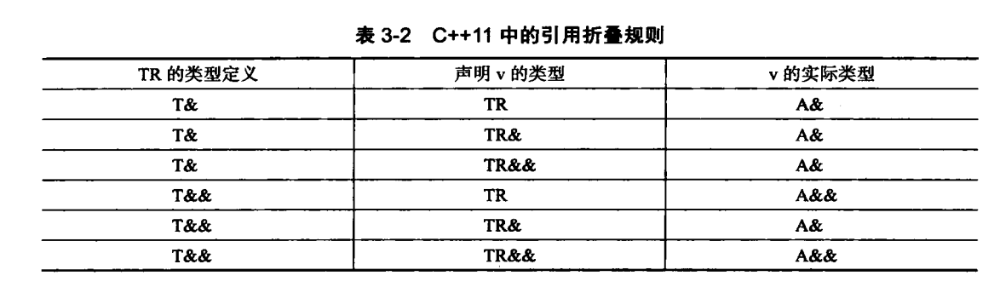

## 稳定性和兼容性
1. 保持与C99兼容   
1.1 预定义宏__func__: 支持打印类,  不可用于默认参数  
1.2 __Pragma操作符：  __Pragma("once") 类似于 #ifndef #define #endif 
1.3 变长参数的宏定义 __VA_ARGS__   #define PR(...) printf(__VA_ARGS__)

2. 静态断言
c++ 本身在 <cassert> 中, 提供了 assert() 方法, 可通过 定义宏 NDEBUG 禁用 assert     
由于assert仅在运行后校验, 添加 static_assert 用于编译时期的断言, 但断言必须是常量   

3. noexcept

4. sizeof 
c++ 98 对非静态成员变量使用 sizeof 不合法, c++ 11合法  

5. override/final

6. 函数的默认 模板
template <typename T = int> class Test{} 这个在 c++98/c++11 都合法, 但 template<typename T = int> void Test() 在 c++98 非法, 在 c++ 11 合法   

7. 外部模板
当一个模板  在不同的 cpp 中被使用时, 模板会被实例化两次, 此时就像定义了两次函数, 会造成冲突   
在一个实例中使用显式具体化 template void func<int> ()   在另外一个使用 extern template void func<int> () 即可   

8. 局部类型 和 匿名类型 可以在 c++ 11 当做模板参数  

## 通用性

1. 继承构造函数
struct A {A(int a, int b){} }    struct B: A {using A::A}, 则B可直接使用A的构造函数   B b{1,2}    
但是基类的构造函数的默认参数不会被继承  否则会造成歧义    struct A { A(int a = 5)}, 此时使用的是默认的构造函数 还是构造函数带参数的  不明确    
如果多重继承 struct A { A(int a){}}   struct B {B(int b){}}   此时若 struct C:A,B {using A::A; using B::B} 此时冲突了   应该使用   struct C:A,B {using A::A;using B::B;  int(int c)} 重新定义了冲突的构造函数   
如果使用了继承构造函数, 则不会生成默认构造函数了

2. 委派构造函数
不允许在构造函数中 调用构造函数     
struct A { A();  A(int a):A(); int c; }  
不能同时使用 委派构造函数 和 初始化列表   struct A {A();  A(int a):A(),c(a)} 这个是非法的

3. 右值引用
右值分为: 纯右值(非引用返回的临时变量值 或者字面量) 和 将亡值(返回的右值引用 和 std::move的返回值)   
左值引用是具名变量的别名  右值引用是不具名变量的别名   
如果没有提供移动构造函数  则调用拷贝构造函数     
如果提供了 拷贝构造函数 拷贝赋值函数 移动赋值函数 析构函数 其中的一个或多个 则不会生成默认的移动构造函数     反之 不会生成拷贝构造函数

4. 完美转发  std::forward
参数传递过程中, 参数左右值类型可能发生改变, 完美转发就是为了解决此问题   
引用折叠规则   

5. 显式转化操作符 
struct Test {explict Test(int n = 0, int i = 1){}}  则 Test test = 1 非法, Test test(1) 合法, 去掉 explict 则都可行   

6. 初始化列表  {}

7. POD   Plain Old Data
拥有平凡的构造函数 和 析构函数    一旦定义了构造函数就不平凡    可通过添加=default  就可恢复平凡
拥有平凡的拷贝构造函数和移动构造函数  也可通过 default 恢复平凡    
拥有平凡的赋值函数  
不能包含虚函数  和 虚基类    
std::is_trivial 判断是不是平凡的   
非静态成员变量 要么都是 private 要么是 public  

8. 非受限联合体 union

9. 自定义字面量

10. 内联名字空间 inline namespace

11. 模板的别名  using   使用 std::is_same<type1,type2>::value, 这个函数是在编译器取得的

## 易学易用

1. auto 类型推导 

2. decltype   type_info的name函数返回类型,has_code返回唯一的哈希值    区别于is_same 这个是在运行时取得的  类型推导时, 不会继承const等cv

## 提高安全性 

1. enum class 
enum class type : char {General, Light} 说明该强类型枚举是基于 char

2. 智能指针 和 垃圾回收 
unique_ptr share_ptr 和 weak_ptr     
unique_ptr 不能 直接赋值, 只能通过所有权转移的方式    unique_ptr<int> up1 (new int(11)); 则 unique_ptr<int> up2 = up1 不合法; 可以通过 unique_ptr<int> up2 = std::move(up1)    可以通过成员函数 reset 重置   
share_ptr 可以直接相等 是因为有引用计数    
weak_ptr 指向 share_ptr 的对象  却不拥有该对象 可通过 lock 函数返回 share_ptr 

## 提升性能 以及 操作硬件的能力
1. 常量表达式
由 const 指定的大部分情况下是运行时常量   const int GetConst() {return 1;}   则此时 int arr[GetConst()] = {} 是非法的   可用过 constexpr, 但要求只能是单一的返回语句   
常量表达式使用前必须被定义  仅仅声明是不够的  例如  constexpr const int GetConst();  使用后 int arr[GetConst()] = {}, 后面再实现 其方法  这种方式不可行     
不支持自定义类型， 需要自定义常量构造函数  struct MyType {constexpt MyType(int i)}     constexpr MyType type = {0}  

2. 变长模板   
va_start va_arg va_end    
宏定义 __VA_VARGS__    
模板参数包:  指的是在模板参数位置上的变长参数 

3. 并行编程
原子操作 atomic_llong  普遍采用 std::atomic<T>  <cstdatomic>  禁止拷贝, 只能使用同一个
POSIX 线程 pthread_create  pthread_join   
c++ 11 线程  std::thread   join 

4. 内存模型 
顺序一致性:  一般函数是按顺序运行的, 如果优化时, 可能存在情况, 函数不按照顺序运行   void test() { int a = 1; int b =1 }, 如果此时自旋锁在等待b, 打印a, 如果 b 先运行可能导致结果不正确    

5. 线程局部存储   thread_local 

6. 快速退出 
quick_exit 与 exit 同属于正常退出       但是 quick_exit 
退出不执行析构函数    
at_quick_exit 与 at_exit 一样  

## 为改变思想方式而改变  

1. nullptr为编译时期的常量  类型为 nullptr_t

2. lambda 函数  [capture](params) mutable -> return-type {statement}
capture 捕捉上下文变量提供给 lambda 使用  
[=,&a,&b] (int c, int d) -> int {return 1}  以引用传递的方式传递 a, b 其他的用值传递 

## 实际应用 

1. 数据对齐 
查询边界  alignof(Struct)  
设置边界  struct alignas(32) Struct {}  

2. 通用属性 
c++ 11 [[noreturn]]     gnu __atrribute__((noreturn))

3. Unicode 的支持 
u8:UTF-8(char)   u:UTF-16(char16_t)   U:UTF-32(char32_t)    
使用 'u\xxxx' 4个十六进制的码位表达 Unicode 字符 
std::codecv<type1,type2,std::mbstate_t> 用于转化 

4. 原生字面量  R"(msg)"