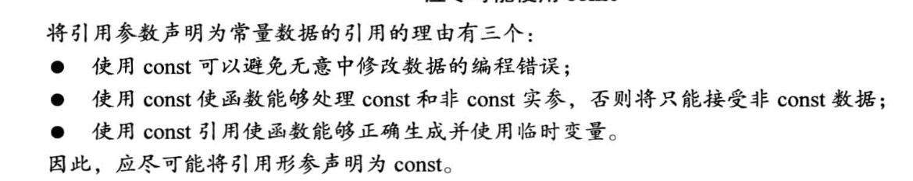
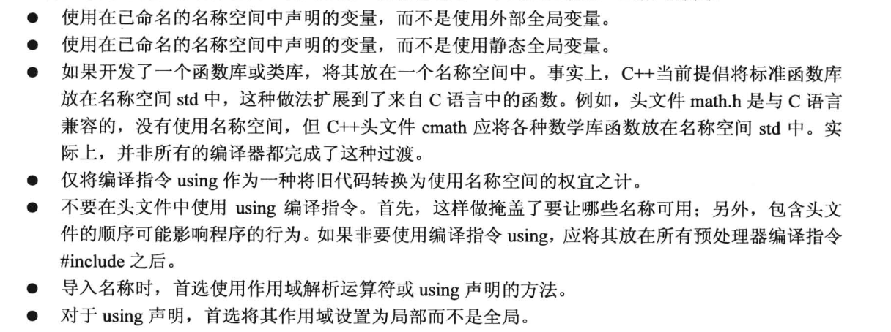

## 头文件
1. C 代码注释风格 /* C-style */
2. C++ 使用预处理器, 有些C++使用翻译器将C++程序转为C。
3. 将 include <iostream> 文件的内容添加到程序, 这种行为称为预处理。include 编译指令导致 iostream文件内容随源代码一起被发送给编译器
4. C语言传统头文件扩展名h(math.h), C++没有扩展名, 有些C头文件转为C++头文件去掉扩展名前面加C(cmath)
5. hpp和h扩展头文件的区别是, hpp的某些实现也在其中

## 数据类型
1. wchar_t 有两种方式进行支持: 1. 编译厂商将char定义为16位   2. 使用 wchar_t   L"test"
2. c++ 11 新增 char16_t(无符号16位  u"Test")  char32_t(无符号32位  U"Test") 用以支持 unicode
3. const 限定符  必须先定义  const Month; Month = 12; 非法
4. auto 自动转化
5. 数组自动化计算长度  int things[] = {1,2,3};  c++ 11初始化禁止缩窄  int things[3]{1,2,3};   long things[3]{1,2,3};(not allow) 
6. C++ 11 原生字面量 R"(Test)"
7. 匿名共用体
8. 枚举值  enum Color {red, green = 10} 可强制类型转化 Color unknown = Color (5);   最大可转化的值为离10最近的 2 的倍数 -1    2x2x2x2 -1 = 15;
9. 指针指定地址    int* ptr; *ptr = 20; 如此不好, 只说明了地址存放了20的值  并没有说明存放在何处 | int* ptr; ptr = 0xxxxx 是非法的, 因为 0xxxx是数字整形 可以用 (int*) 0xxxx
10. C++ 11 有四种管理数据内存的方式: 自动存储  静态存储   动态存储  线程存储
11. 传递数组参数做法: 传统方式传递数组指针和个数   STL方式传递两个指针第一个元素和最后一个元素的末尾(超尾), 例如arr[20]传递arr[0]和arr+20

## 关于const指针
不管const写成如何，读懂别人写的const和*满天飞的类型的金科玉律是const默认作用于其左边的东西，否则作用于其右边的东西：        
1. const int * ptr = &age, 其中 const 作用于 int, 说明指向的值是恒定的, 但是可以修改指向的地址, 此时地址的值可以不一样
2. int const * ptr = &age, 其中 const 作用于 int, 与 1 一致
3. int* const = &age, 其中 const 作用于 int*, 说明指向的地址不变, 内容可变
4. const int * const = &age, 都不可修改
5. int const* const, 左边的const修饰int, 右边的const修饰 int*, 如5

## 文件操作
1. 对于控制台提供了 头文件 <iostream> 中的 写入 ostream 类的 cout 对象, 读取 istream 类的 cin 对象(使用eof()和fail()) 
2. 对于写入文件提供了 头文件 <fstream> 中的 写入 ofstream 类的 自定义对象,  读取 ifstream 类
3. good() 在没有出错时, 返回true; 类型不匹配 fail() 返回 true; 文件受损或者硬件故障 bad() 返回 true; 结束 eof() 返回 true 

## const 引用
1. 实参与引用参数不一致, 生成临时变量作为参数, 仅 const 时会发生转化
2. 若参数为 const, 生成临时变量的两种情况: 1. 类型匹配, 但是不是左值 (test(1), 其中1为右值, 因此会产生临时变量)   2. 类型不匹配， 但是可以转化为匹配的类型
3. const 才会发生, 原因在于如果不指定 const， 用户的意图可能是修改传递的值, 而临时变量与期望不符合, 而指定了 const 则说明本身传递的就是常值, 不会进行修改, 因此编译器期望参数含有 const 才进行自动类型转化
4. 引用参数尽量用 const
5. 函数返回值 test &, 此处注意返回的变量不能是临时在函数中分配的变量, 可以是参数传递的 引用再将其返回, 也可以用 其中new外面释放(unique_ptr)
6. const test &, 此处指定了 const, 为了避免 test& func(test& a), 在上述式子中, func(test1) = test2 是合法的, 因为没有 const, 返回的是可修改的左值, 加了 const, 可以避免修改

## const 变量
1. 一般变量在函数外部的, 链接性为外部, 而加上 const 为内部, 类似于 static 的效果

## 函数模板
1. c++98 template<class T>, c++ 11 template<typename T>
2. 局限性, 如模板里面比较大小, 可能结构不支持, 两种方法: 1. 操作符重载   2. 特定类型具体化模板
3. 函数名: 1. 非模板函数  2. 模板函数 template  3. 显示具体化模板函数 template <> void Test<test>(test & a)
4. 1. 隐式实例化(直接使用函数)  2. 显式实例化 template void Test <test> (test & a)  3. 显示具体化 template <> void Test<test>(test & a)  区别在于   显式具体化要求模板不实现, 而由具体化实现
5. 函数选择优先级: 1. 完全匹配  2. 提升转换  3. 标准转换 4. 自定义转换
6. auto func (type a, type b) -> decltype(a+b)

## 命名空间
1. 命名空间可以存在于另外一个命名空间内, 但不能位于代码块内
2. 除了用户自定义命名空间, 还存在全局命名空间, 全局变量存在于全局命名空间
3. 使用using编译指令和使用using生命不一样
4. namespace myth{using Jill::fetch;}  获取 myth::fetch
5. namespace myth = namespace too_log_namespace {...}
6. 匿名命名空间 namespace {...}, 由于没有名字无法在其他文件使用可以类似实现 static 的功能   namespace {int count;}

## 类
1. const Stock land =  Stock{}; land.show(); 此方法可能有错, 因为针对show方法, 无法保证不修改 land 的值, 应该定义 void show() const;
2. 只要类方法不修改调用的对象, 尽量将其定为 const
3. 类中只是定义类结构, 不应该出现 const 初始化赋值 class Stock {private: const int Month=12;} 如此是不允许的, 但可以使用 enum, 或者 static int Month=12, 因此 static 在初始的时候应该被赋值
4. 操作符重载和友元函数

## 记录疑问
1. 参数传递数组const不变, arr[0] 不可变, arr[1] 是否可变
2. 默认参数后与无默认参数的  相同的函数调用, 调用哪一个