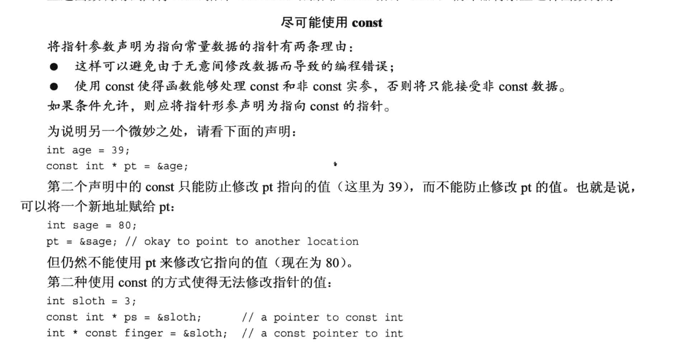

## 头文件
1. C 代码注释风格 /* C-style */
2. C++ 使用预处理器, 有些C++使用翻译器将C++程序转为C。
3. 将 include <iostream> 文件的内容添加到程序, 这种行为称为预处理。include 编译指令导致 iostream文件内容随源代码一起被发送给编译器
4. C语言传统头文件扩展名h(math.h), C++没有扩展名, 有些C头文件转为C++头文件去掉扩展名前面加C(cmath)
5. hpp和h扩展头文件的区别是, hpp的某些实现也在其中

## 数据类型
1. wchar_t 有两种方式进行支持: 1. 编译厂商将char定义为16位   2. 使用 wchar_t   L"test"
2. c++ 11 新增 char16_t(无符号16位  u"Test")  char32_t(无符号32位  U"Test") 用以支持 unicode
3. const 限定符  必须先定义  const Month; Month = 12; 非法
4. auto 自动转化
5. 数组自动化计算长度  int things[] = {1,2,3};  c++ 11初始化禁止缩窄  int things[3]{1,2,3};   long things[3]{1,2,3};(not allow) 
6. C++ 11 原生字面量 R"(Test)"
7. 匿名共用体
8. 枚举值  enum Color {red, green = 10} 可强制类型转化 Color unknown = Color (5);   最大可转化的值为离10最近的 2 的倍数 -1    2x2x2x2 -1 = 15;
9. 指针指定地址    int* ptr; *ptr = 20; 如此不好, 只说明了地址存放了20的值  并没有说明存放在何处 | int* ptr; ptr = 0xxxxx 是非法的, 因为 0xxxx是数字整形 可以用 (int*) 0xxxx
10. C++ 11 有四种管理数据内存的方式: 自动存储  静态存储   动态存储  线程存储
11. 传递数组参数做法: 传统方式传递数组指针和个数   STL方式传递两个指针第一个元素和最后一个元素的末尾(超尾), 例如arr[20]传递arr[0]和arr+20

## 关于const指针
不管const写成如何，读懂别人写的const和*满天飞的类型的金科玉律是const默认作用于其左边的东西，否则作用于其右边的东西：        
1. const int * ptr = &age, 其中 const 作用于 int, 说明指向的值是恒定的, 但是可以修改指向的地址, 此时地址的值可以不一样
2. int const * ptr = &age, 其中 const 作用于 int, 与 1 一致
3. int* const = &age, 其中 const 作用于 int*, 说明指向的地址不变, 内容可变
4. const int * const = &age, 都不可修改
5. int const* const, 左边的const修饰int, 右边的const修饰 int*, 如5

## 文件操作
1. 对于控制台提供了 头文件 <iostream> 中的 写入 ostream 类的 cout 对象, 读取 istream 类的 cin 对象(使用eof()和fail()) 
2. 对于写入文件提供了 头文件 <fstream> 中的 写入 ofstream 类的 自定义对象,  读取 ifstream 类
3. good() 在没有出错时, 返回true; 类型不匹配 fail() 返回 true; 文件受损或者硬件故障 bad() 返回 true; 结束 eof() 返回 true 

## 记录疑问
1. 参数传递数组const不变, arr[0] 不可变, arr[1] 是否可变