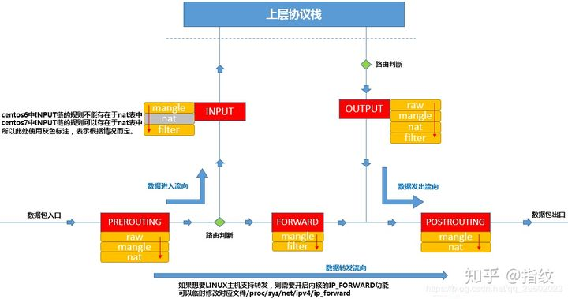

## 说明
ip-rule是路由策略的说明，指定了某些策略绑定ip route路由表


## ip-rule

### ip rule list
列出所有的策略表

``` shell
➜  ~ ip rule list
0:      from all lookup local 
32766:  from all lookup main 
32767:  from all lookup default
```

其中三条缺省规则，lookup 寻找路由表
local 对应 255 表
main 对应 254表
default 对应 253表

``` c
➜  ~ ip route show table default 
➜  ~ ip route show table 253 
```
可以看出都是空的

可以自定义 1 - 252 张route表

### 关系图


### 参数详解

#### ip rule list 打印目标规则
可以直接使用，也可以在后面加参数    
模板 ip rule list Selector

``` c
➜  ~ ip rule list to 192.168.1.1
32765:  from 10.42.88.8 to 192.168.1.1 lookup main
```

#### ip rule add 添加规则
模板 ip rule add Selector Action   
比list多出action


#### Selector
``` doc
       SELECTOR := [ not ] [ from PREFIX ] [ to PREFIX ] [ tos TOS ] [
               fwmark FWMARK[/MASK] ] [ iif STRING ] [ oif STRING ] [
               pref NUMBER ] [ l3mdev ] [ uidrange NUMBER-NUMBER ] [
               ipproto PROTOCOL ] [ sport [ NUMBER | NUMBER-NUMBER ] ] [
               dport [ NUMBER | NUMBER-NUMBER ] ] [ tun_id TUN_ID ]
```

``` shell
// from/to PREFIX 标记网段
➜  ~ sudo ip rule add from 10.22.0.0/16 table main
➜  ~ ip rule list
32762:  from 10.22.0.0/16 lookup main
```

``` shell
// iif 入口设备 
➜  ~ sudo ip rule add iif eno1 table local
➜  ~ ip rule list
32761:  from all iif eno1 lookup local
```

#### Action
``` doc
       ACTION := [ table TABLE_ID ] [ protocol PROTO ] [ nat ADDRESS ] [
               realms [SRCREALM/]DSTREALM ] [ goto NUMBER ] SUPPRESSOR
               
       nat 已废弃
```

``` shell
// unreachable 丢弃某些数据包
➜  ~ sudo ip rule add to 220.181.0.0/16 unreachable
➜  ~ ping baidu.com
connect: 网络不可达
```

## ip-route
### ip route
列出所有路由表
``` shell
➜  ~ ip route 
default via 10.20.43.1 dev eno1 proto dhcp metric 100 
10.20.43.0/24 dev eno1 proto kernel scope link src 10.20.43.136 metric 100 
```

保存位置
``` shell
➜  ~ cat /etc/iproute2/rt_tables 
#
# reserved values
#
255     local
254     main
253     default
0       unspec
#
# local
#
#1      inr.ruhep
```


### 参数详解

### ip route show
可以直接使用，也可以在后面加参数  默认展示的是 table main 
ip route show SELECTOR

``` shell
➜  ~ ip route show root 10.20/16 
10.20.43.0/24 dev eno1 proto kernel scope link src 10.20.43.136 metric 100 
```

### ip route get
``` shell
       ip route get ROUTE_GET_FLAGS ADDRESS [ from ADDRESS iif STRING  ]
               [ oif STRING ] [ mark MARK ] [ tos TOS ] [ vrf NAME ] [
               ipproto PROTOCOL ] [ sport NUMBER ] [ dport NUMBER ]
```
获取单个路由规则，需要带上目标地址
``` shell
➜  ~ ip route get from 10.20.43.136 to 192.168.1.1
192.168.1.1 from 10.20.43.136 via 10.20.43.1 dev eno1 uid 1000
```

### ip route add
添加里有规则    
ip route add ROUTE 

### Selector
``` doc
       SELECTOR := [ root PREFIX ] [ match PREFIX ] [ exact PREFIX ] [
               table TABLE_ID ] [ vrf NAME ] [ proto RTPROTO ] [ type
               TYPE ] [ scope SCOPE ]
```
scope SCOPE_VALUE，地址有效的区域的范围。可用的作用域列在文件“/etc/iproute2/rt_scopes“中。预定义的范围值是：  
global ，地址全局有效。      
site ，(仅IPv 6)该地址为站点本地地址，即该地址在此站点内有效。   
link ，该地址是本地链接，即它仅在此设备上有效。       
host ，该地址仅在此主机内有效。

``` shell
➜  ~ ip route show scope link
10.20.43.0/24 dev eno1 proto kernel src 10.20.43.136 metric 100
```

### ROUTE

``` doc 
ROUTE := NODE_SPEC [ INFO_SPEC ]
```

### NODE_SPEC
``` doc
       NODE_SPEC := [ TYPE ] PREFIX [ tos TOS ] [ table TABLE_ID ] [
               proto RTPROTO ] [ scope SCOPE ] [ metric METRIC ] [ ttl-
               propagate { enabled | disabled } ]    
               
       TYPE := [ unicast | local | broadcast | multicast | throw |
               unreachable | prohibit | blackhole | nat ]                   
```
unicast ，路由条目描述到路由前缀所涵盖的目的地的实际路径。  
unreachable ，这些目的地是无法到达的。丢弃数据包，生成不可访问的ICMP消息主机。本地发件人得到一个EHOSTUNEACH错误。      
blackhole ，这些目的地是无法到达的。数据包被静默丢弃。本地发送者得到一个EINVAL错误     
prohibit ，这些目的地是无法到达的。丢弃数据包并生成ICMP消息通信，该ICMP消息通信在管理上被禁止。本地发件人得到一个EACCES错误。    
local ，目的地分配给此主机。数据包被环回并在本地传送。          
broadcast ，目的地是广播地址。数据包作为链路广播发送。          
throw ，与策略规则一起使用的特殊控制路径。如果选择这样的路由，则将终止此表中的查找，假装没有找到路由。如果没有策略路由，则相当于路由表中没有路由。丢包并生成不可到达的ICMP消息网。本地发送者得到一个ENETUNEACH错误。       
nat ，一条特殊的NAT路线。前缀覆盖的目的地被认为是虚拟地址(或外部地址)，需要在转发之前转换为真实地址(或内部地址)。选择要转换到的地址，并附带属性警告：Linux2.6中不再支持路由NAT。

``` shell
➜  ~ sudo ip route add unreachable 220.181.0.0/16 table 100
➜  ~ sudo ip rule add to 220.181.0.0/16 table 100
➜  ~ ping baidu.com
connect: 没有到主机的路由

➜  ~ sudo ip route add blackhole 220.181.0.0/16 table 100
➜  ~ ping baidu.com
connect: 无效的参数
```

### INFO_SPEC
``` doc
INFO_SPEC := { NH | nhid ID } OPTIONS FLAGS [ nexthop NH ] .
```

``` shell
// ip tunnel
➜  ~ sudo ip route add 220.181.0.0/16 encap ip id 100 dst 10.20.44.52 dev eno1 table 100
➜  ~ ping baidu.com
PING baidu.com (220.181.38.251) 56(84) bytes of data.
From 10.20.43.136 (10.20.43.136) icmp_seq=1 Destination Host Unreachable
```

``` shell
// gateway
➜  ~ sudo ip route add 172.16.0.0/16 via 10.20.43.136 dev eno1 table 100
```

### OPTIONS
``` doc
       OPTIONS := FLAGS [ mtu NUMBER ] [ advmss NUMBER ] [ as [ to ]
               ADDRESS ] rtt TIME ] [ rttvar TIME ] [ reordering NUMBER
               ] [ window NUMBER ] [ cwnd NUMBER ] [ ssthresh NUMBER ] [
               realms REALM ] [ rto_min TIME ] [ initcwnd NUMBER ] [
               initrwnd NUMBER ] [ features FEATURES ] [ quickack BOOL ]
               [ congctl NAME ] [ pref PREF ] [ expires TIME ] [
               fastopen_no_cookie BOOL ]
```


## 参考
https://man7.org/linux/man-pages/man8/ip-rule.8.html       
http://blog.itpub.net/29270124/viewspace-2637451/       
https://man7.org/linux/man-pages/man8/ip-route.8.html       
https://feisky.gitbooks.io/sdn/content/     
