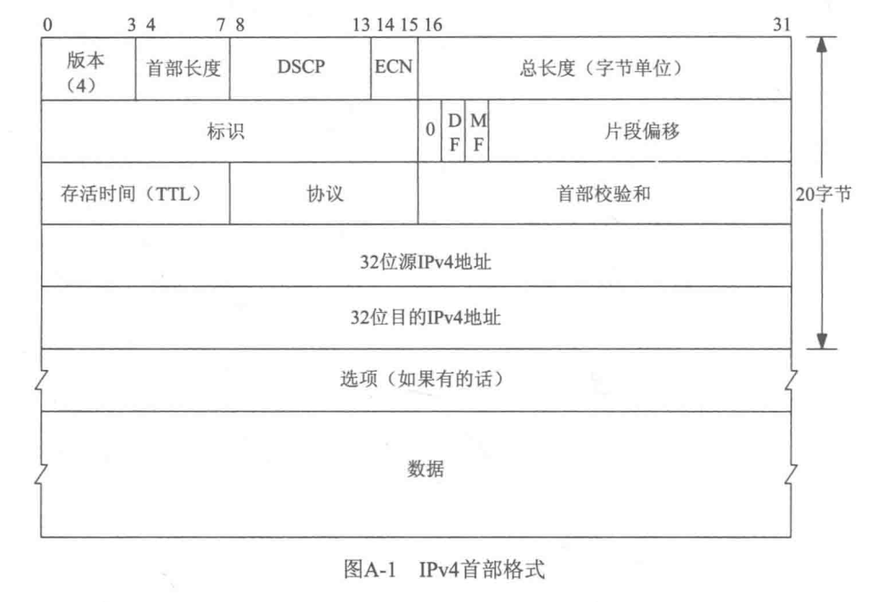
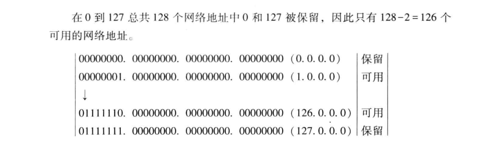
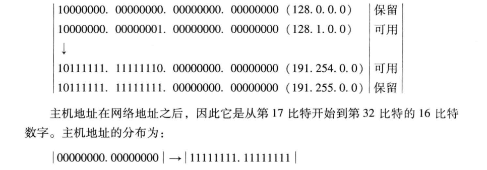
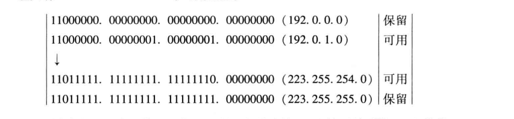
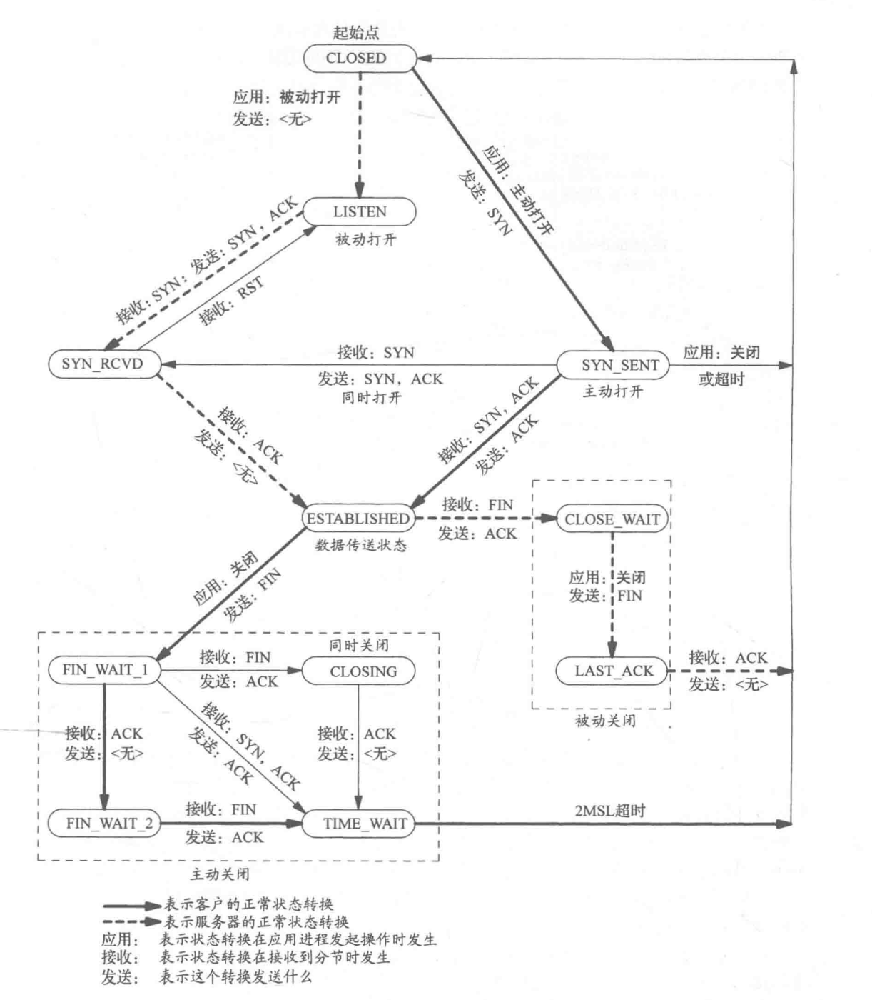
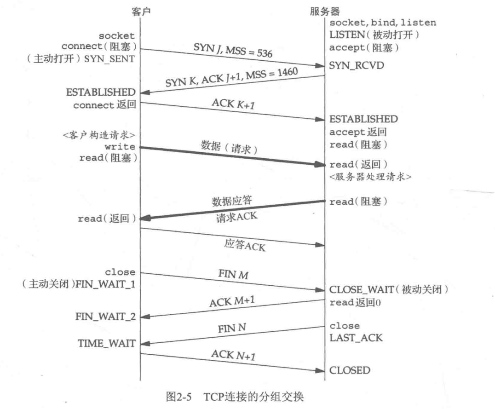
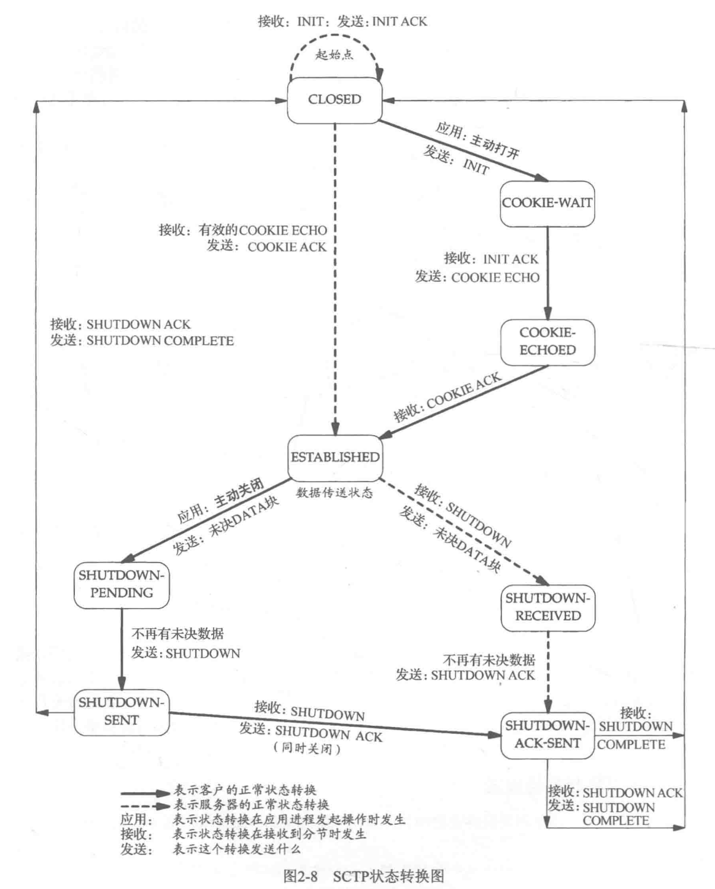
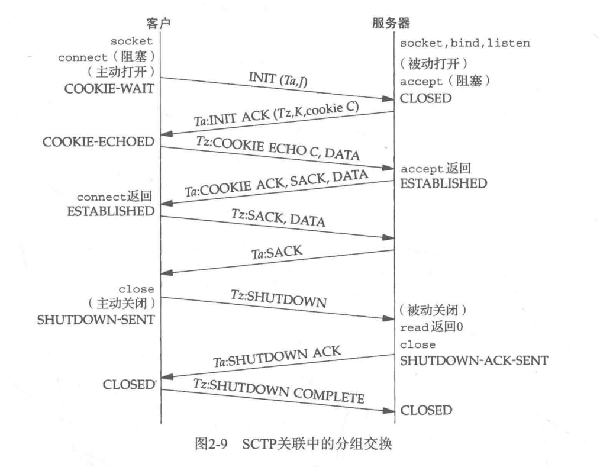

## 说明
此文档用于记录一些基础的通信协议

## IPv4协议

协议报文   

1. 前四个字段标识版本  如ipv4  ipv6            
2. 首都长度：为15字节  每个自己标识4位，所以首部包含ipv4选项总共60字节，去掉首部20字节，所以选项是40字节      
3. DSCP:差分服务代码点Differentiated Services Code Point,用于保证通信的Qos，用于保证IP优先级，逐跳等行为    
4. ECN: 显示拥塞通知，也是为了保证Qos       
5. 总长度：整个报文的长度     
6. 标识：分段的标识     
7. 0：  占位    
8. DF： 决定是否进行IP分片，不分片可能会导致路由分片错误   
9. MF: more fragment 说明还有分片  
10. 片段偏移：   数据偏移 用于重组         
11. TTL： 存活时间，其实就是限制跳转的次数    
12. 协议： 上一层的协议是 TCP UDP SCTP等等   
13. 首部校验和：16位校验首部是否损坏

### 地址分类
#### A类地址
网络部分占8比特，主机占24比特，也就是 /8       
首位位0 

#### B类地址
网络部分占16比特   主机占16特比   也就是  /16    
首位位10

### C类地址
网络部分占24比特  主机占8比特   也就是 /24    
前三位  110

### 多播地址

## TCP基础

### 状态流转图

MSL: max segment lifetime 分节最大的生命期

TIME_WAIT选项： 等待2MSL

TCP为已发送的数据保存副本  用以确认是否已经发送成功

1. 可靠的双工停止，被动close的终端最后收到FIN时，会发送ACK会FIN，等待主动发送CLOSE的端发送ACK。如果ACK消失，被动CLOSE将再次发送FIN。此时需要确保本段处于非CLOSE状态，避免发送RST。
2. 为了保证旧包消失。可能存在双端的IP和端口都是一致的问题。这时候，如果不等待时间，可能某个时间段内，有个旧包在网络上，如果此时到达，会被认为是新包。

### 选项
1. MSS 最大分节  接收到对端的MSS，意味着当前本端能发送的最大分节
MSS一般是MTU - IP首部大小   以太网中MSS是1460

2. 窗口规模  能发送的窗口大小
3. 时间戳    

### 缓存区大小的影响
1. ipv4 最大的大小是 65535 字节，

## SCTP基础

### 状态流转图

其中cookie有效信息的状态     
服务器每次都会夹带客户端的Ta    
客户端每次都会夹带服务端的Tz

所以不需要TIME_WAIT，只需要确认每次的Ta  Tz即可

## UDP 