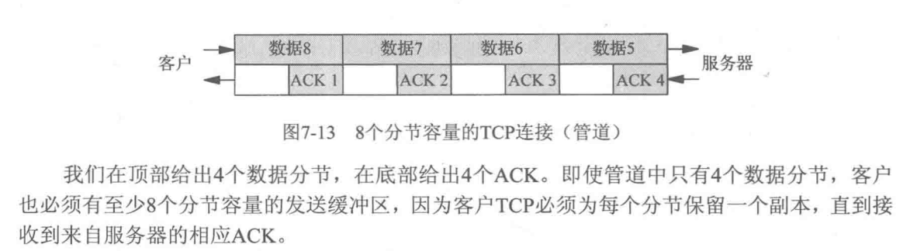

## 说明
此文档用于记录一些基础的通信协议

## IPv4协议

协议报文   

1. 前四个字段标识版本  如ipv4  ipv6            
2. 首都长度：为15字节  每个自己标识4位，所以首部包含ipv4选项总共60字节，去掉首部20字节，所以选项是40字节      
3. DSCP:差分服务代码点Differentiated Services Code Point,用于保证通信的Qos，用于保证IP优先级，逐跳等行为    
4. ECN: 显示拥塞通知，也是为了保证Qos       
5. 总长度：整个报文的长度     
6. 标识：分段的标识     
7. 0：  占位    
8. DF： 决定是否进行IP分片，不分片可能会导致路由分片错误   
9. MF: more fragment 说明还有分片  
10. 片段偏移：   数据偏移 用于重组         
11. TTL： 存活时间，其实就是限制跳转的次数    
12. 协议： 上一层的协议是 TCP UDP SCTP等等   
13. 首部校验和：16位校验首部是否损坏

### 地址分类
#### A类地址
网络部分占8比特，主机占24比特，也就是 /8       
首位位0 

#### B类地址
网络部分占16比特   主机占16特比   也就是  /16    
首位位10

### C类地址
网络部分占24比特  主机占8比特   也就是 /24    
前三位  110

### D类多播地址

## TCP基础

### 状态流转图

MSL: max segment lifetime 分节最大的生命期

TIME_WAIT选项： 等待2MSL

TCP为已发送的数据保存副本  用以确认是否已经发送成功

1. 可靠的双工停止，被动close的终端最后收到FIN时，会发送ACK会FIN，等待主动发送CLOSE的端发送ACK。如果ACK消失，被动CLOSE将再次发送FIN。此时需要确保本段处于非CLOSE状态，避免发送RST。
2. 为了保证旧包消失。可能存在双端的IP和端口都是一致的问题。这时候，如果不等待时间，可能某个时间段内，有个旧包在网络上，如果此时到达，会被认为是新包。

### 选项
1. MSS 最大分节  接收到对端的MSS，意味着当前本端能发送的最大分节
MSS一般是MTU - IP首部大小   以太网中MSS是1460

2. 窗口规模  能发送的窗口大小
3. 时间戳    

4. SO_RCVBUF和SO_SNDBUF至少应该是MSS的四倍，最好是偶数倍

5. SO_REUSEADDR选项   
1）允许启动绑定一个端口，此端口的listen和accept结束，但是子进程未结束
2) 允许在同一端口绑定不同的ip  主要是INADDR_ANY
3) UDP协议可以绑定同一个IP和端口

6. SO_REUSEPORT选项
1) 允许完全相同的绑定

7. 

### 缓存区大小的影响
1. ipv4 最大的大小是 65535 字节，
2. 

## SCTP基础

### 状态流转图

其中cookie有效信息的状态     
服务器每次都会夹带客户端的Ta    
客户端每次都会夹带服务端的Tz

所以不需要TIME_WAIT，只需要确认每次的Ta  Tz即可

## UDP 

## 双栈

## 广播

1. 对于 {子网ID,-1}的广播，路由器不转发此广播
比如收到 192.168.42.0/24 的广播包 到 192.168.123.255/24， 路由器不糊转发到 192.168.123.0
2. 路由器不转发 {-1.-1}的广播包

不允许对广播数据包进行分片  如果超过外出接口的MTU， 返回EMSGSIZE

## 多播
1. 224.0.0.1是所有主机组，子网上的设备，如果接口具有多播的能力，必须加入该组
2. 224.0.0.2是所有路由器的组，所有路由器接口如果具有多播功能需要加入该组
3. 224.0.0.0到224.0.0.255为链路局部多播地址，多播路由器不转发已这些为目的地的数据报

多播地址范围:
1. 接口布局的
2. 链路局部的
3. 管区局部的
4. 网点局部的
5. 组织机构局部的
6. 全球或全局的

原理：
将多播地址映射到数据链路层地址，如224.0.1.1，映射为01:00:5e:00:01:01，告知链路层接收该地址的以太帧      

不完备过滤：告知接口接收以特定以太网地址为目的地的帧，但是通常也会接收其他帧，发生在链路层          
完备过滤：经过IP层进一步筛选，比对目的地

1. 首先终端声明加入多播组，例如H5，此时通过IGMP消息告知路由器MR4，MR4又通过MRP告知其他多播路由器
2. 发送者发送多播消息，此时H1接到，路由器MR1接到，MR1将多播消息发给MR2
3. MR2将多播消息发给本地，消息副本发给MR3
4. MR3发生消息到MR4
5. MR4发生给子网

### 广域网多播难点
1. 多个路由器交换MRP请求，
2. IPV4多播地址不足

### 源特定多播 SSM
1. 接收地址将发送地址的信息也作为多播组的一部分，可以避免收到所有组播消息
2. 单播源和多播目的地地址结合，成为通道

## 套接字选项
SO_KEEPALIVE设置针对的是上操作系统所有的选项

## 基础套接字
1. SOCK_RAW, protocol字段一般不为空 fd = socket(AF_INET,SOCK_RAW,IPPROTO_ICMP)
2. 设置IP_HDRINCL，自行设置IP
3. 很少使用bind connect 因为没有端口

### 输出
1. 普通输出通过 sendmsg sendto 套接字已连接的可以通过write send
2. 套接字选项IO_HDRINCL，自行设置IP地址 IP标识可设为0 内核自动填充   ipv4首部校验和内进程计算(581页表述矛盾) IPv4选项字段可选
3. 内核会对超过借口MTU进行分片

### 输入
1. 接收到的UDP和TCP消息不会传到原始套接字， 可以到链路层读取
2. ICMP IGMP消息传到原始套接字  内核不认识的IP数据包传到原始套接字
3. 数据报没有在内核重组完成，则不传递到原始套接字

### 内核匹配三个测试 通过则传到此套接字
1. 协议参数protocol匹配
2. bind connect的地址相同  则报送
3. 如果原始套接字 协议指定0  且未bind connect  该套接字可接收内核传递到原始套接字的副本

## 数据链路访问

BSD过滤器   

DLPI 

PF_PACKET与SOCK_PACKET   
