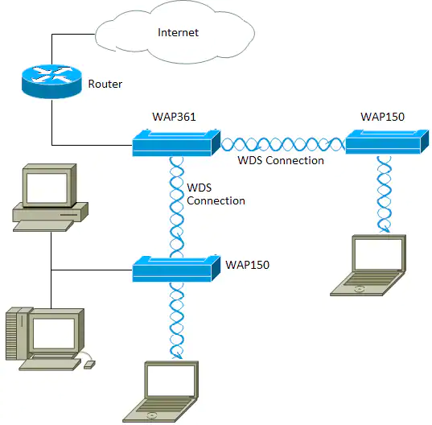

## 说明
无线分布式系统WDS（Wireless Distribution System）是指AP之间通过无线链路连接两个或者多个独立的局域网，组建一个互通的网络实现数据传输。

## 概念
业务型VAP：传统WLAN网络中，AP是为STA提供的WLAN业务功能实体。VAP是AP设备上虚拟出来的概念，即一个AP上可以创建多个VAP以满足多个用户群组的接入服务。

WDS型VAP：WDS网络中，AP是为邻居设备提供WDS服务的功能实体。WDS型VAP又分为AP型VAP和STA型VAP。AP型VAP为STA型VAP提供连接功能。AP3上创建的VAP13即为STA型VAP，AP2上创建的VAP12即为AP型VAP。

线虚链路WVL（Wireless Virtual Link）：相邻AP之间STA型VAP和AP型VAP建立的WDS链路。

## 架构图
各AP之间不通过有线，而通过无线连接

## 工作模式
从模式上讲，WDS具有三种工作模式，分别是自学习模式、中继模式和桥接模式。

## 参考
https://zhuanlan.zhihu.com/p/189890451