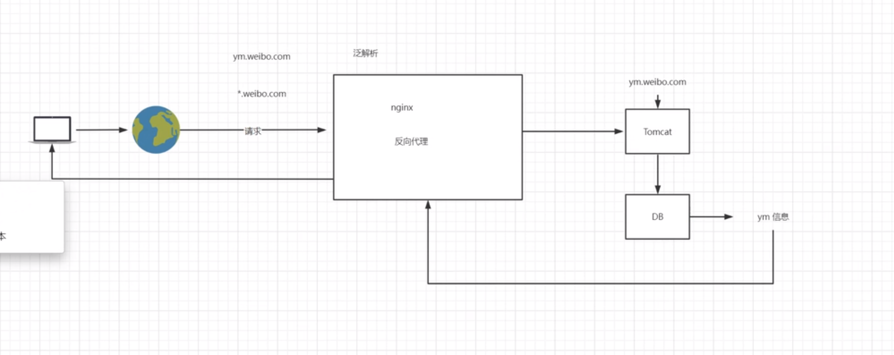
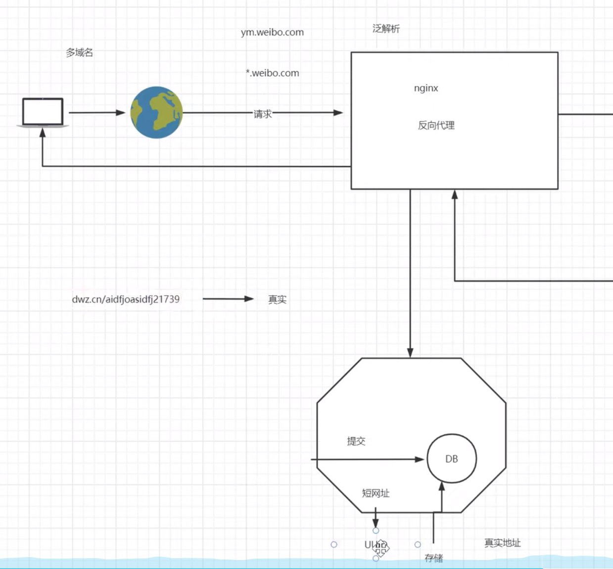
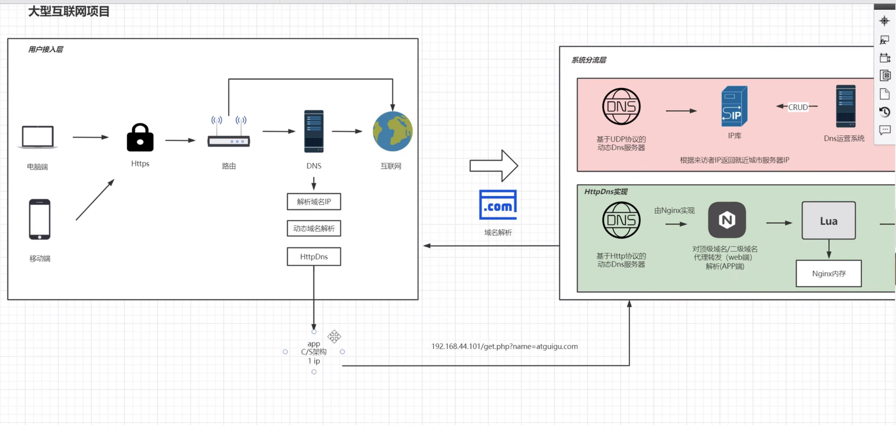

@[toc]


# 虚拟主机和域名解析 


## http 协议
1. 一台主机, 一个 ip两个域名, 则在http协议 请求头 Host 添加域名  
``` conf 
目录 -> atguigu.com -> /root/www/atguigu.com  
目录 -> void.atguigu.com -> /root/www/void.atguigu.com
``` 


## 域名解析实战   
### 多用户二级域名 
通配符 *.atguigu.com   范解析   
通过 nginx 做反向代理服务器, 请求转发到 tomcat, tomcat 解析域名 
查询数据库 获取相关信息, 返回给 nginx 



### 短网址 



### httpdns 
1. 使用与 C/S 架构, 不适合 B/S 
2. dns 解析器的 ip 预埋进 app, 将请求发送到 httpdns (http://192.168.44.101/get.php?name=atguigu.com)



