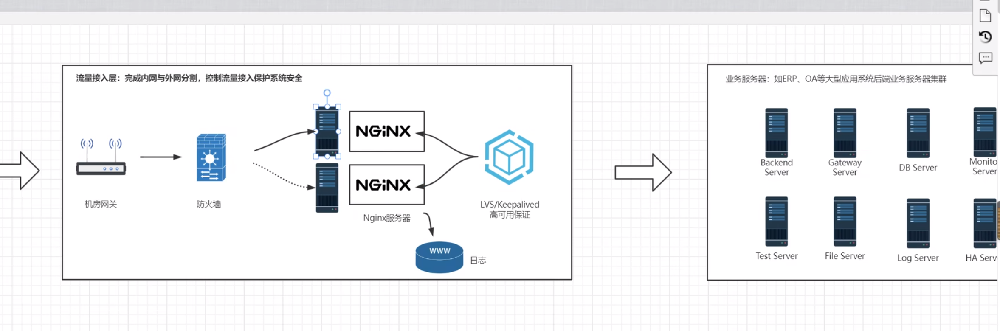
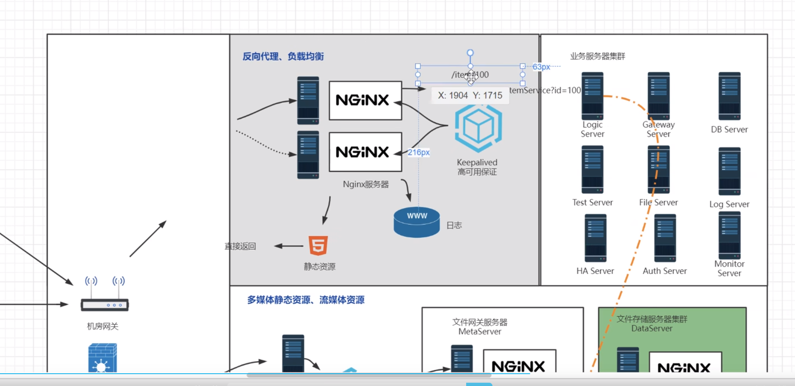
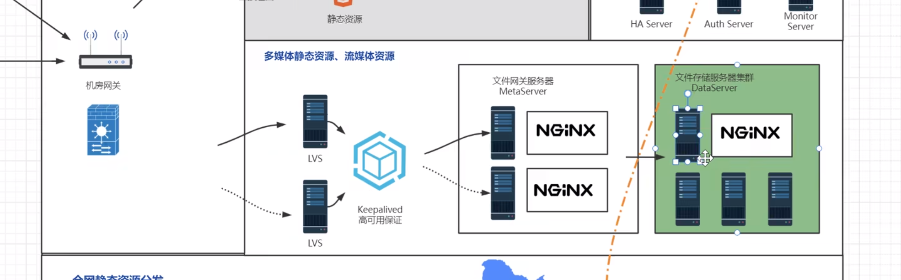
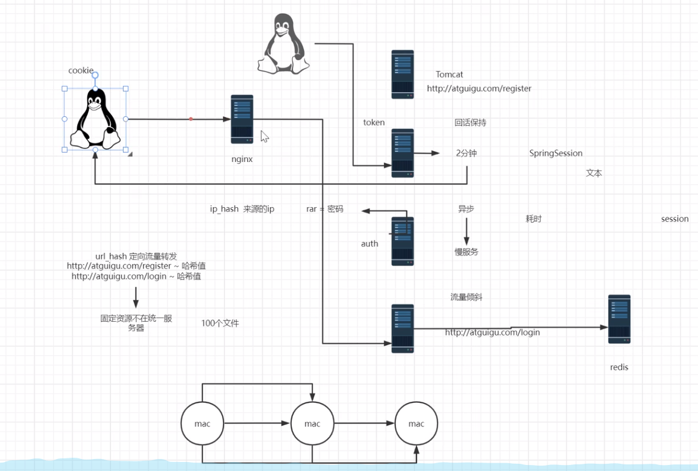

# 反向代理
## 网关  代理   反向代理 
隧道式道理 请求和回复都通过 nginx 代理服务器转发    
DR(direct routng): 请求通过 nginx, 回复直接回复客户端(发送给机房的网关, 再发送给外网), LVS负载均衡的做法

## 反向代理应用场景 
1. 传统的服务器架构,   
nginx反向代理服务器
   


2. 中小型企业架构    
起到更多作用:   
伪装真实地址(URL rewrite)       
/itemService?id=100 伪装为 /item/100.hmtl (权重更高)
 

文件服务器    
传递大流量数据时, nginx 会成为瓶颈, 需要多配置几个 nginx(负载均衡器)



## 基于反向代理的负载均衡器 
1. 负载均衡集群(提供一样的服务的一组服务器)   

2. 负载均衡算法策略 (retry)      
轮询:  按照轮询顺序进行, 但是无法保持会话 (Session无法保存, 可能会造成cookie丢失, 要求重新登陆)      
权重:  weight(按照权重比例, 例如weight=5)   down(服务器宕机)   backup(备份服务器)      
ip_hash:   为了保持会话, 相同的 hash 发送到相同的 负载均衡服务器, 但是手机移动时, 可能会造成 ip 变化, 或者机器没有外网 ip, 通过交换机共用一个 ip, 其中一台压力会增大, 适合内网环境下使用, 其中一台服务器宕机, 会话信息会消失, 会要求重新登陆    
url_hash:    定向流量转发, 相同的 url 转发到 同一台服务器, 会将login 和 后续请求分配在不同的服务器上, 适合下载文件, 定向流量转发到存放文件的服务器       
least_conn:   分摊负载, 分配给最少连接, 可能是由于配置权重     
fair:   

会话保持方案是服务器做无状态, 状态同一保存到 redis 服务器(小型)   
token 存放一个专门的 auth 信息的服务器   


### 负载均衡配置 
``` conf 
http {
    server {
        location / {
            # 代理转发到 baidu.com 和 root 只有生效一个 
            proxy_pass http://baidu.com;
        }
    }
}
```