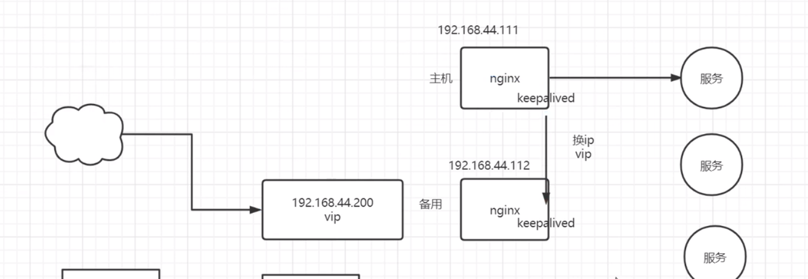

## rewrite  
rewrite /xx.html ?pagenum=xx break;   
将 xx.html 请求重写为 ?pagenum   
好处是 让客户端以为在访问静态文件, 效果直观  
break 可以改为 redirect(返回302)  permanet(返回301)    

## refer 防盗链 
会带上次请求的 url 访问新的资源  (例如从上个css访问img, 对于 img 请求会带上 css 的url)     
通常 invalid 时, 采用 rewrite 显示禁止盗链图片

``` shell
# 允许 referer 的链接   
valid_refers http://xxx   
none  没有 或者 正确的情况下 可以访问, 错误的时候不能访问   

# 当出现不允许的请求时  返回403   
if ($invalid_refers) {return 403};    
``` 

## 高可用配置 HA (keepalived)   
1. 交换机假死状态(过热, 短时分区故障, 两个机柜间突然不能访问, 形成了两个分区)    
不能简单公用一个 ip 来解决, 短时分区故障发生时, 若keepalived 简单替换 ip, 故障恢复时, 出现两个相同 ip 的机器  
希望有 主机 和 备份机, 可采用 virtual ip (vip)    
![short_part] (../asset/nginx_short_part.png)    
使用一个 vip, 此 ip 只出现在一台 机器上    
   

### keepalived 配置 
``` conf  
global_defs {
  router_id nginx
}

vrrp_instance VI_1 {
    # 主备关系
    state MASTER
    # 网卡名 
    interface eth0
    virtual_router_id 51
    # 权重 
    priority 100
    advert_int 1
    authentication {
        auth_type PASS
        auth_pass 1111
    }
    virtual_ipaddress {
        # 所有用户访问的 虚拟 ip 
        192.168.200.14
    }
}
``` 

### docker 启动 keepalived 
需要在外面 docker run --cap-add=NET_ADMIN 配置设置权限,     
否则会出现 rtnetlink answers: operation not permitted   

### nginx 和 keepalived  
由于 keepalived 只能检测自身 是否正常, 无法检测 nginx 是否正常    
如果 nginx 宕机, keepalived没有宕机, 则 keepalived 不会主动断开     
可以采用 shell 脚本 动态检测, 或者 cron 任务, 检测到 nginx 宕机时, 主动杀死 keepalived   