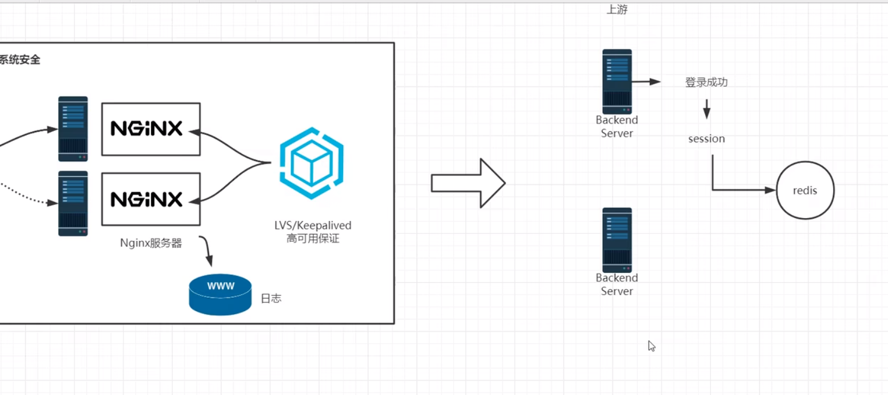
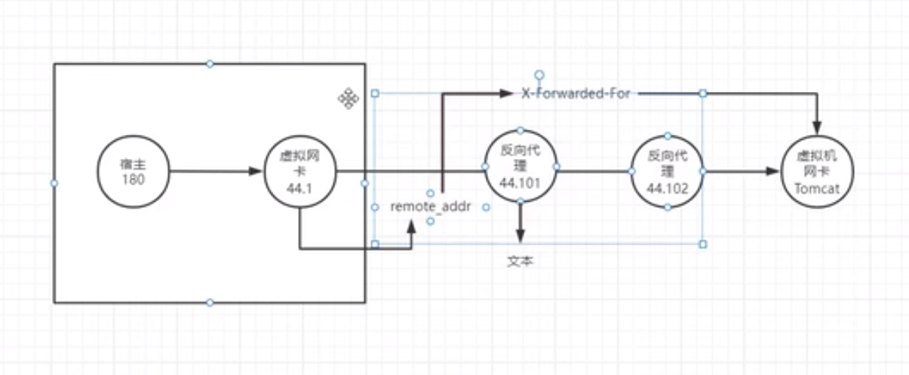
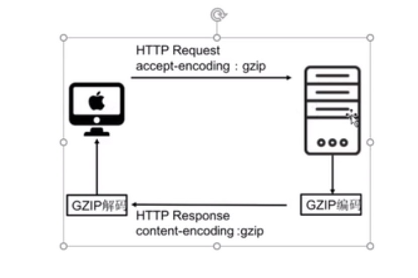
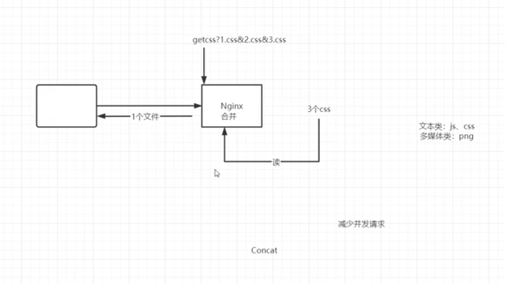
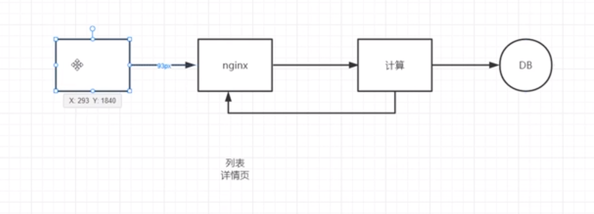
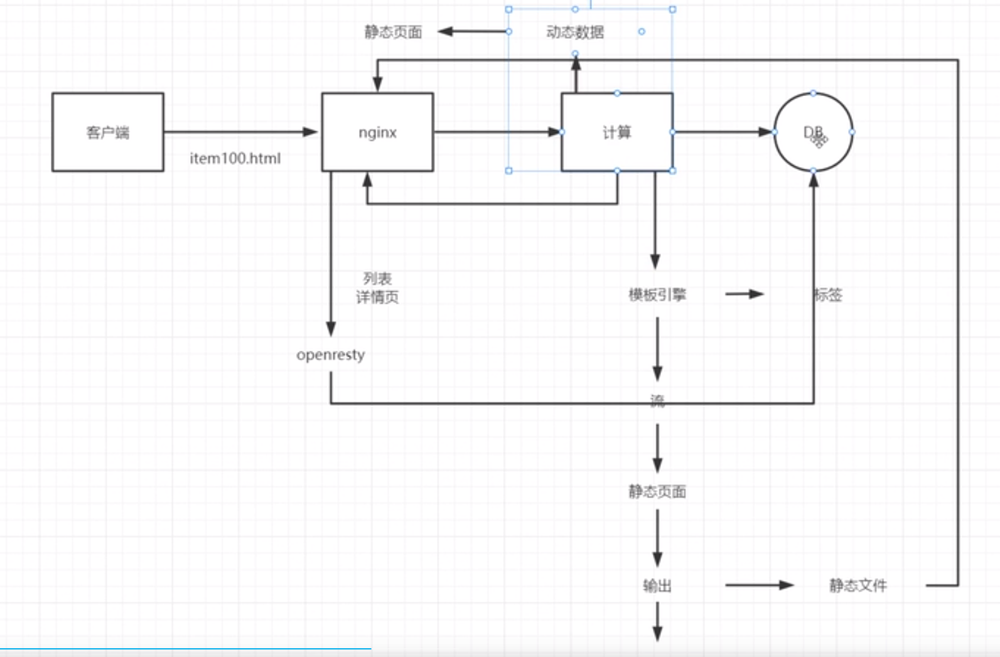
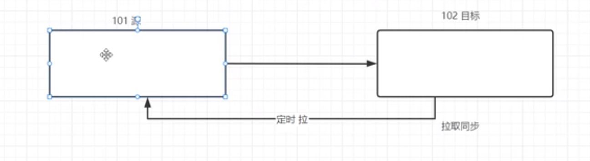

## 扩容  

### 单机扩容 (垂直扩容) 
增加硬件资源    
HDD   STA  SSD  带宽  等 

### 水平扩容 
集群化     

#### 集群 nginx 的特点 
不保存 用户的 session 会话    
1. ip_hash        
中小型项目, 可能会造成流量倾斜 和 cookie上下文 丢失    

cookie_jsessionid    
将 json id 写入 url 上, jsessionid 是由 tomcat 等下发的,   
如果没有 tomcat 和 hash 其他 

request_uri        
访问相同的 url 时, 会被转发到相同的 机器, 在不 支持 cookie 的机器, 可以做到会话保持      

使用 lua 二次开发实现 定向流量分发    

2. redis + spring session     
性能比 nginx 保持会话低, 当请求多时, redis 压力大, 系统设计的复杂度高  
    

3. sticky 模块 会话保持     
不需要上有服务器支持 session 即可保持会话       
此 cookie id 是 nginx 下发的, jsessionid 为 tomcat 下发的   
``` conf 
upstream xxx {
    # cookie 名称, 避免使用相同的 id 
    sticky name=xxx ;
    server xxx.xxx.xxx.xxx;
}
```


#### 集群化 细分  
1. 数据分区    
将一部分数据分别放在不同的机器上, 其他的放在另外的机器上   

2. 上游服务 SOA 化  
spring cloud  服务器技术架构, 拆分更细的模块    
nginx 可以拆分成 (每个 nginx 代理后端的某个服务集群)  

3. 入口细分  

4. 数据异构化   
多级缓存:   客户端缓存    CDN缓存   异地缓存   nginx缓存     

5. 服务异步化  
拆分请求:   
拆分请求(将一个请求拆分为多个请求, 下载前告诉用户多大, 再多线程请求下载, 或者不完全展示靠点击触发)    
消息中间件    


 
### 扩容原则 
无状态原则    
弹性原则    


## keepalive  

### 针对下游客户端的配置
优点复用 连接       
图片等 希望被缓存到 本地, 不希望下次重新请求, 则不使用 keep alive     

``` conf 
http {
    # 活动超时 关闭时间, 设置为 0 则关闭 keepalive
    keepalive_timeout 65;   
    # 禁用某些浏览器 keepalive (如IE)
    keepalive_disabled misie6;
    # 在 单一的 keepalive 的 socket 可以发起多少个请求
    keepalive_request 1000;
    # 两次写的操作间隔的最大时间  
    send_timeout 10 
} 
```

### 针对上游服务器的配置 
http客户端, 经过 nginx 转发后, 转发给上游服务器时, head 会被清楚   
这样就无法知道真实客户地址    
``` conf 
http { 
    server {
        # 上游服务器保留的连接数  lru算法
        keepalive 100
        # 禁用某些浏览器 keepalive (如IE)
        keepalive_disabled misie6;
        # 在 单一的 keepalive 的 socket 可以发起多少个请求
        keepalive_request 1000;
        # 1.0 版本针对 keepalive 需要 "Connection: keep-alive", 而 1.1 则默认指定了
        proxy_http_version 1.1;
        # 设置头 ()
        proxy_set_header Connection "";
    }
}

```

## 缓冲 (非缓存)   
使用 epoll 模型 读取  


``` conf 
http {

    # 读取 client 的 body的 缓冲区大小 
    client_body_size 1024;
    # 是否等待 缓冲区 满了以后, 再转发给上游服务器 
    proxy_request_buffering on; 
    # 上游服务器的数据发送过来时, 是否需要缓冲再发送
    proxy_buffering on;
    # 
    set_head
}
```

### 上下游速率不同步的问题 
主要针对 proxy_buffering 这个选项    
下游 想要下载数据时, 向 nginx 发起请求, 下载的速率通常打不到峰值,    
而 上游与 nginx 通常是内网, 速度快, 会造成不同步的问题。   

proxy_buffering off 不缓冲   
nginx 读取上游数据 立马转发 给下游, 
这样会造成 nginx 与上游 的读 socket一直被占用。   

因此最好将 proxy_buffering on,  
可以设置 proxy_buffers 32 64k, 在内存中 设置缓冲大小为 32*64k 的内存大小     

``` conf 
http {
    # header 缓冲区, 没有 body 缓冲区, 可以当作 body 缓冲区  
    proxy_buffer_size 1024;
    # 是否开启 内存缓冲  
    proxy_buffering on;
    # 内存 缓冲区大小 
    proxy_buffers 32 64k;
    # 最大能写最大入磁盘文件的大小  
    proxy_max_temp_file_size 32 64k;
    # 向磁盘写入缓冲的大小 
    proxy_temp_file_write_size 8k;
    # 磁盘文件位置 
    proxy_temp_path /www/web/temp_file 1 2;
}
```


### 对客户端的配置 

``` conf
# 针对客户端缓冲区 
client_body_buffer_size 1024;
# head 大小  
client_header_buffer_size 1024;
# 默认 1m, 当 body 参数超过了, 会报错, 设置为 0 
# "Content-Length"
client_max_body_size 1m;
# 发送到一半  不动的超时时间  
client_body_timeout 65s;
```

## 获取真正的 ip 地址   
针对 tomcat 服务器 X-Forwarded_For 的地址无法被伪造, 因为 nginx 会重新设置地址为 remote_addr  
此 remote_addr 与 nginx 是物理连接的地址     

``` conf 
location / {
    # 设置远端的 ip 地址  
    proxy_set_header X-Forwarded_For $remote_addr;
}
```

针对多级 nginx 转发, 可能出现 remote_addr 可能会被覆盖的问题, 可以选择在后续的 nginx 中    


也可以使用 逐级添加的方式 X-Forwarded_For: ip1, ip2   


## 压缩模块 
设置的压缩等级越高, 体积越小, 传输快, 解压缩慢 
   


### 动态压缩  
从上游接收数据后, 再发送给 客户端   
坏处是没办法启用 sendfile 特性  

``` conf 
http {
    location / {
        gzip on;
        # 内存缓冲  
        gzip_buffers 16 8k;
        gzip_comp_level 6;
        gzip_http_version 1.1; 
        gzip_types text/application;
        # 只针对反向代理服务器生效, 任何请求都会被压缩 
        # expired(头存在 expired则压缩)
        gzip_proxied any;
    }
}
```

``` shell
# 说明压缩类型  
content-encoding: gzip
# 数据包以一个个的包 发送, 最后发送的是 0 字节则说明结束了
Transfer-Encoding: chunked  
# 对应 chunked, 知道具体的长度  
content-length: 57126

```

### 静态压缩    
将 nginx 服务器里面的内容, 预先打包成 gzip, 再使用 sendfile 发送   
不适合做反向代理服务器时使用, 更适合做资源服务器的适合使用     
通常配个 gunzip 使用, 磁盘空间可能同时存在源文件和压缩文件, 使用 gunzip 可仅保存压缩包     
通常图片使用 gunzip, 文本文件只使用 gzip  

``` conf 
# 需要重新编译
--with-http_gzip_static_module  
--with-http_gunzip_module

http {
    # 推荐使用 gzip: always gunzip: on
    # on 客户端支持时, off 关闭, always 总是打开
    gzip_static on/off/always;
    # 打开 gunzip
    gunzip on;
    # 缓冲区大小 
    gunzip_buffers 16 8k;
}
```

### brotli  
google开源的压缩, 内置压缩字典     


## 压缩请求数  concat 
将多个请求合并成一个, nginx 将文件以流的形式合并, 再发送给客户端     
sendfile 用不了    
淘宝以 "??" 开头的就是 concat   
同时需要修改 css 文件, 在文件前面增加 ??   
不能跨服务器, 


``` conf 
location / {
    concat on;
    concat_max_files 20;
}
```

   


## 资源静态化  

传统的资源模型   
 

可以将动态数据从数据库里面拿到资源, 将动态数据生成静态页面, 保存在 nginx 服务器中    
客户端请求 nginx, 如果资源不存在, openresty 可以直接请求 db 数据库获取资源    
openresty 内置模板引擎 

 


### 资源同步 
由于 nginx 需要集群化, 需要保证每台 nginx 上面的资源都是一致的, 
通常使用  rsync 工具同步, 一台 nginx 作为种子服务, 分发到其他服务器  
静态页面可能存在动态数据,    
前端合并:  使用 html 或者 javascript 在请求中内嵌链接, 消耗请求数   
后端合并:  SSI 合并多个链接    
两个校验:  用户在购物车的时候采用 nginx 的数据, 在结算的时候去真实服务器校验   

### 合并文件输出   
需要在 html 中添加 "<!--# icnlude file == "" -->"

``` conf 
location / {
    # 开启 ssi 
    ssi on;
    # 
    ssi_last_modified on;

}
```


### 文件同步   

``` shell 
# 开启 rsync 服务 
rsync --daemon
# 远程连接 rsync, 显示文件 
rsync --list-only --password-file xxx user@10.20.100.10::/ftp;
# 从远端拉取文件  
rsync --avz --passwd remote_addr local_path  
# 推送到远端   
rsync --avz --passwd local_path remote_addr  
# 监控文件变化   
inotifywait -mrq 
```

``` conf
# 需要权限用户推送文件, 解决文件权限问题
uid = root 
gid = root 

# 用户   
auth users = sgg
# 权限需要修改成 600 
secret file = /etc/passwd.pw
# 是否只允许读
read only = on

[ftp]
    path = /tmp/xxx
```

定时同步     
     


