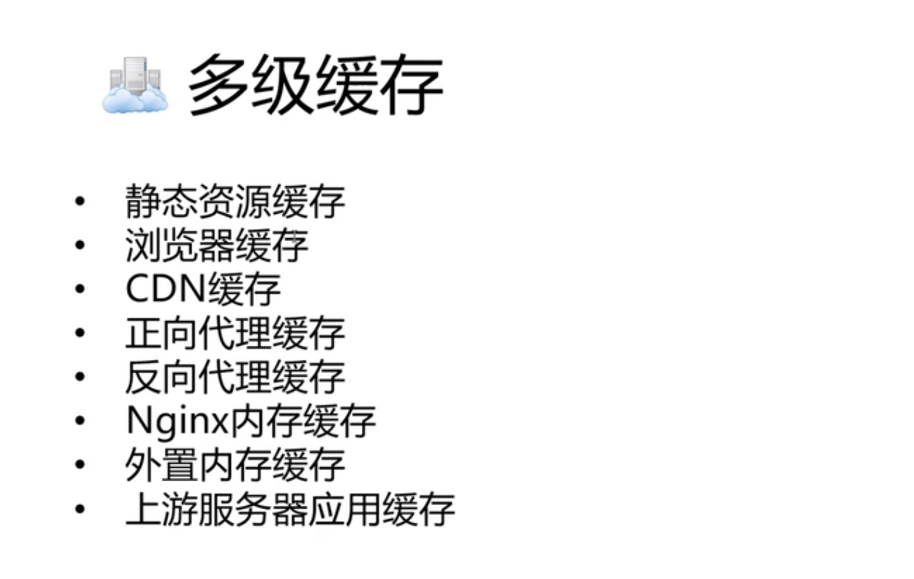
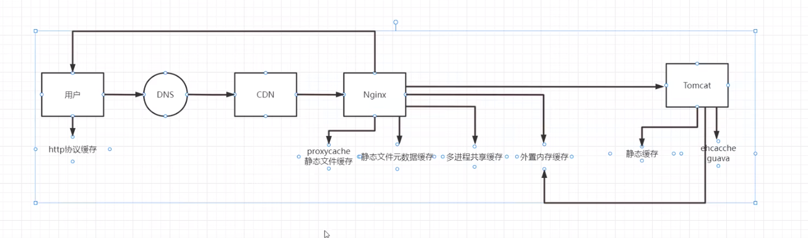
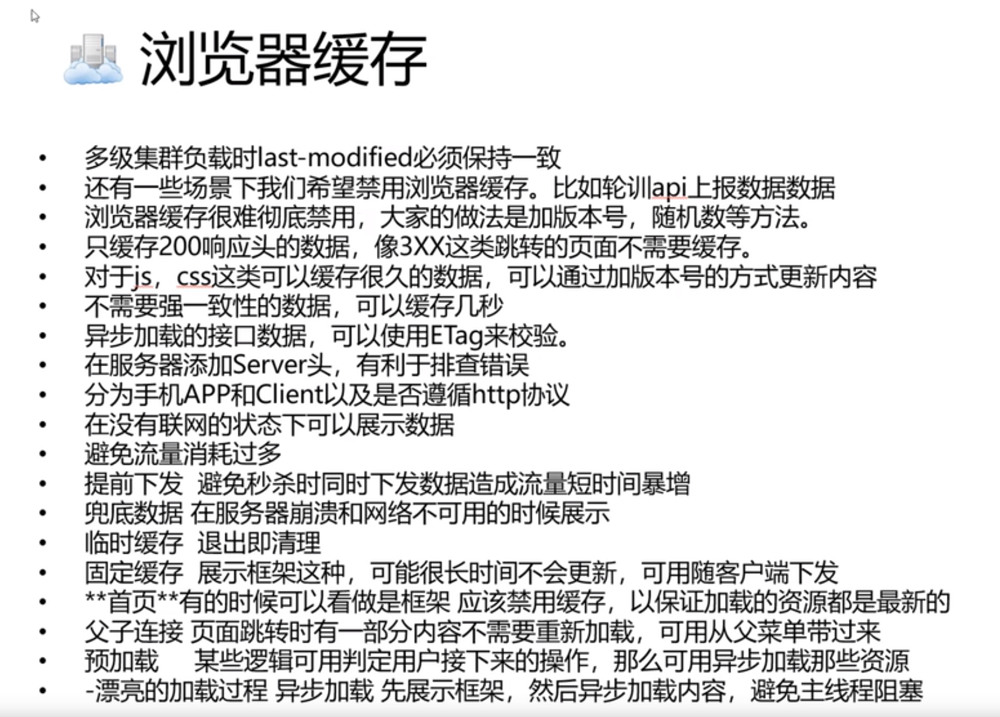
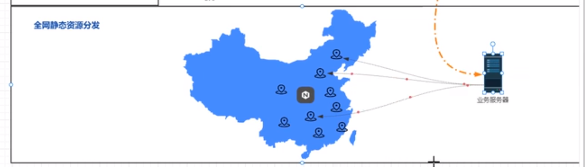

       
    

### 资源静态缓存   

### 浏览器缓存     
App提前预埋数据:       
"双11"热门商品, 客户端显示即将开始, 刷新后, 变为可以抢购, 服务器可以接收用户刷新了哪些商品, 再下发给客户端, 对于非常热门商品, 到时间后, 立马显示已抢光, 即使发送了数据, nginx 也屏蔽了数据     

浏览器内:   
memory cache, disk cache   

两种  
``` shell 
# 指定过期时间, 这种方式不上报数据到服务端, 客户端即可完成校验
expires: Fri, 12 Aug 2022 15:13:20 GM 
etags: ........
# 再次请求时, 会带上这个这个标签, 服务器查找文件看看修改日期是否一直, 一直则返回304 
# nginx 默认 采用 etags 和 last-modified 方式 
last-modified: Mon, 23 May 2022 13:20:41 GMT
# request 请求时, 此词条对应 last-modified 
if-modified-since: 23 May 2022 13:20:41 GMT
# request 请求时, 此词条对于 etags
if-none-match: ..........

# http 1.1 字段  no-cache: 必须发送到服务器端确认是否可以使用缓存   no-store: 禁用缓存  
cache-control: max-age=3600
```

``` conf 
location / {
    etag off;
    # 配置 expired 过期时间, 有些浏览器不支持   
    expired 300s;
    # 设置值为空, 则每次都会请求   
    add_header last-modified "";
    # 关闭 modified, 缓存, nginx 返回200 和数据  
    if-modified-since off;
}
```

  


### CDN缓存    
全网内容分发   一般存储的是静态缓存   现在支持动态缓存     
对于热门资源, 变成静态资源存储在 cdn 
     

geoip2  

``` conf 
http {
    # 指定 geoip2 路径
    geoip2 /www/dbpath {
        # 获取客户机的 区域
        # Country: CN 
        # dns 可以使用此配置, 设置解析的 ip (联通  电信等)
        $geoip2_country_code_contry iso_code;
    }
}
```


### 代理服务器请求    
热点信息缓存在内存中, 次级内容缓存在磁盘上    


### 代理缓存   
1. 正向代理  
nginx 也支持正向代理, 不多  
需要客户端和nginx同时配置  

ngx_http_proxy_connect_module  

``` conf 
# nginx 配置 
resolver 8.8.8.8;
location / {
    proxy_pass $scheme://$host$request_uri
}

客户端 通过正常的配置 
http_proxy = xxxx
https_proxy = xxxx
```


2. 反向代理缓存    


``` conf 
upstream xx {
    
}

http {
    # 配置缓存路径  
    # test_cache 内存可用的大小是 100m, 储存的是文件 hash 索引
    proxy_cache_path /path levels=1:2 key_zone=test_cache:100m inactive=1d max_size = 10g;

    server {
        location / {
            add_header nginx-cache "$upstream_cache_status";
            proxy_pass http://xx;
            proxy_cache test_cache;
            # 内存有效区
            proxy_cache_valid 1h;
            # 以 uri 作为 key
            proxy_cache_key $uri;
            # 文件超过多少时, 不缓存文件  
            proxy_cache_max_range_offset 10m;
            # 哪些情况下可以继续使用缓存  
            proxy_cache_use_state error/timeout;
            # 更新缓存是否加锁 
            proxy_cache_lock off;
            # 最少使用次数后, 才缓存   
            proxy_cache_min_uses 1;
        }
    }
}
```

``` shell
# 存放着文件 key 
[root@7e7a7b069d31 /] cat /ngx_tmp/0/01/9765b08220ada073b33f9b458a5e2010 
�ec7�bd+�b�qPW/"21630-1660030775000"
KEY: http://cluster/favicon.ico
HTTP/1.1 200 
Accept-Ranges: bytes
ETag: W/"21630-1660030775000"
Last-Modified: Tue, 09 Aug 2022 07:39:35 GMT
Content-Type: image/x-icon
Content-Length: 21630
Date: Sat, 13 Aug 2022 04:41:08 GMT
Connection: close
```

   

#### nginx缓存清理  

使用 nginx_cache_purge 清除缓存   

``` conf 
location ~ /purge(/.*) {
    proxy_cache_purge test_cache $1;
}
```

``` shell 
# 根据 key 采用 purge 清楚缓存  
curl -v http://xxxxx/purge/$key
```

可以在请求的时候, 以 purge 的形式请求, 方便后期删除      
使用 postman 使用 purge 可以直接删除 
``` conf
map $request_method $purge_method {
    PRUGE 1;
    default 0;
}
server {
    location / {
        proxy_cache_purge $purge_method;
    }
}
```


### nginx 内存缓存   
1. 建立文件索引 (key 和 文件描述符 的映射), 适合磁盘文件多, 内容大
2. 进程间共享级别缓存(将文件元数据, 缓存到内存), 适合高频数据访问   


### 外置内存缓存   
redis  memcached   

#### error_page 
``` conf {
    # 跳转到相对路径
    error_page 500 502 /50.html;
    # 302  跳转 
    error_page 404 =302 http://www.xxx.com;
}
```

#### 匿名 location 
只能内部访问, 外部无法访问   
``` conf {
    error_page 404 = @606;
    location @666 {
        add_header "Content-Type" "text/html";
        return 200 "hello";
    }
}
```

#### redis 和 nginx 
使用 redis2_nginx_module, redis 2.0协议版本    

``` conf
location / {
    # redis 认证 连接  
    redis2_query auth user passwd;
    # 将 value 的值设为 first 
    set $value "first";

    redis2_query_set one $value;
    # 连接
    redis2_pass http://xxx:xx; 
}
```

get 请求   
``` conf 
location = /get {
    # 连接
    redis2_pass http://xxx:xx; 
    # redis 认证 连接  
    redis2_query auth user passwd;
    # 完成转义
    set_unescape_uri $key $arg_key;
    # 请求 获取参数 
    redis2_query get $key;
}
```

连接池  
``` conf
upstream xxx {
    keepalive 1024; 
}
```


``` shell 
curl -v http://xxxx/get?key=xxxx;
```


### nginx stream 代理   (tcp协议上 直接做反向代理和负载均衡)   

#### mysql 透明化, 负载均衡配置 

``` conf 
upstream mysql {
    server xxx.xxx.xxx.xxxx:3306;
}

server {
    listen 3306;
    proxy_pass mysql;
}

```