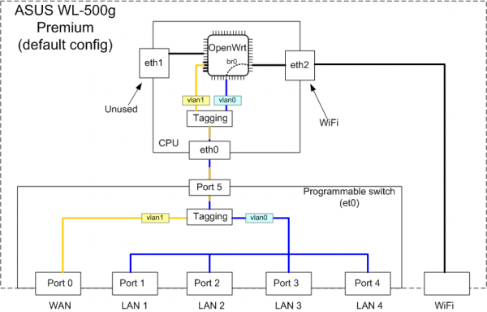

## 说明
使用工具查看openwrt实际配置场景，分析网络拓扑布局。

## 架构图


## ip address 
展示ip地址信息

``` shell
root@OpenWrt:~# ip address show
1: lo: <LOOPBACK,UP,LOWER_UP> mtu 65536 qdisc noqueue state UNKNOWN qlen 1000
    link/loopback 00:00:00:00:00:00 brd 00:00:00:00:00:00
    inet 127.0.0.1/8 scope host lo
       valid_lft forever preferred_lft forever
    inet6 ::1/128 scope host 
       valid_lft forever preferred_lft forever
# 主网卡，一般不直接使用，而通过出多张网卡使用
2: eth0: <BROADCAST,MULTICAST,UP,LOWER_UP> mtu 1500 qdisc fq_codel state UP qlen 1000
    link/ether 20:76:93:35:77:f0 brd ff:ff:ff:ff:ff:ff
    inet6 fe80::2276:93ff:fe35:77f0/64 scope link 
       valid_lft forever preferred_lft forever
# br-lan网桥，设备都接到此网桥，同时通过为dhcp服务器
5: br-lan: <BROADCAST,MULTICAST,UP,LOWER_UP> mtu 1500 qdisc noqueue state UP qlen 1000
    link/ether 20:76:93:35:77:f0 brd ff:ff:ff:ff:ff:ff
    inet 192.168.1.1/24 brd 192.168.1.255 scope global br-lan
       valid_lft forever preferred_lft forever
    inet6 fdf1:c66:60e8::1/60 scope global noprefixroute 
       valid_lft forever preferred_lft forever
    inet6 fe80::2276:93ff:fe35:77f0/64 scope link 
       valid_lft forever preferred_lft forever
# eth0.1未使用
6: eth0.1@eth0: <BROADCAST,MULTICAST,UP,LOWER_UP> mtu 1500 qdisc noqueue master br-lan state UP qlen 1000
    link/ether 20:76:93:35:77:f0 brd ff:ff:ff:ff:ff:ff
# eth0.2接通外部wlan，从上层交换机分配的ip
# config interface 'wan'
        option device 'eth0.2'
        option proto 'dhcp'
        option type 'bridge'
# config interface 'wan6'
        option device 'eth0.2'
        option proto 'dhcpv6'
7: eth0.2@eth0: <BROADCAST,MULTICAST,UP,LOWER_UP> mtu 1500 qdisc noqueue state UP qlen 1000
    link/ether 20:76:93:35:77:f3 brd ff:ff:ff:ff:ff:ff
    inet 10.20.43.23/24 brd 10.20.43.255 scope global eth0.2
       valid_lft forever preferred_lft forever
    inet6 fe80::2276:93ff:fe35:77f3/64 scope link 
       valid_lft forever preferred_lft forever
8: wlan0: <BROADCAST,MULTICAST> mtu 1500 qdisc noqueue state DOWN qlen 1000
    link/ether 20:76:93:35:77:f2 brd ff:ff:ff:ff:ff:ff
9: wlan1: <BROADCAST,MULTICAST,UP,LOWER_UP> mtu 1500 qdisc mq state UP qlen 1000
    link/ether 20:76:93:35:77:f0 brd ff:ff:ff:ff:ff:ff
    inet6 fe80::2276:93ff:fe35:77f0/64 scope link 
       valid_lft forever preferred_lft forever
10: wlan1-1: <BROADCAST,MULTICAST,UP,LOWER_UP> mtu 1500 qdisc mq state UP qlen 1000
    link/ether 20:76:93:35:77:f1 brd ff:ff:ff:ff:ff:ff
    inet6 fe80::2276:93ff:fe35:77f1/64 scope link 
       valid_lft forever preferred_lft forever
```


## ip neigh
展示局域网内，设备信息
``` shell
root@OpenWrt:~# ip neigh
# 此条为wlan口接的交换机地址信息
10.20.43.1 dev eth0.2 lladdr 08:68:8d:3b:d2:01 ref 1 used 0/0/0 probes 1 REACHABLE
# 此条为路由器vlan接通PC设备的ipv4地址信息
192.168.1.113 dev br-lan lladdr a8:a1:59:2e:fc:5f ref 1 used 0/0/0 probes 1 REACHABLE
# 此条为路由器vlan接通PC设备的ipv6地址信息
fdf1:c66:60e8::122 dev br-lan lladdr a8:a1:59:2e:fc:5f ref 1 used 0/0/0 probes 1 REACHABLE
fe80::b5cf:a19f:12aa:9159 dev eth0.2 lladdr 00:e0:70:c7:65:cc used 0/0/0 probes 0 STALE
fe80::2276:93ff:fe35:77f3 dev eth0.2 lladdr 20:76:93:35:77:f3 used 0/0/0 probes 0 STALE
fe80::303f:2f36:3f8c:c591 dev br-lan lladdr a8:a1:59:2e:fc:5f ref 1 used 0/0/0 probes 1 REACHABLE
```