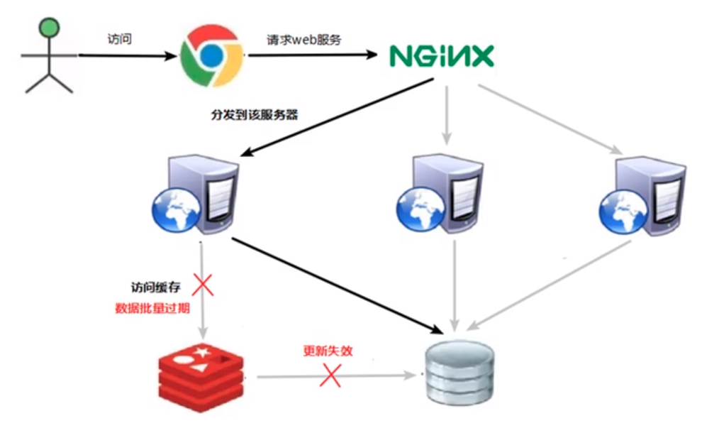

## 说明
用于说明redis使用过程中, 可能存在的问题

## 缓存穿透问题
查询redis没有的数据

1. 应用服务器压力变大, 一般先查缓存, 不存在时, 再查询数据库, 再同步到redis服务器中
服务器压力增大时, 查询的数据第一时间大部分都不在redis, 造成频繁查询数据库, 而导致数据库崩溃
2. redis命中率降
3. 一直查询数据库

造成的原因:
1. redis查询不到数据库
2. 出现非正常的访问  故意频繁查询多个不存在的值  攻击行为

解决方式:
1. 对null进行缓存, 数据库不存在的键值对, 缓存进redis, 避免不存在时取查询数据库, 可以设置较短的过期时间
2. 设置可访问的名单, 设置bitmaps, 用户id进行查询bitmaps, 不存在时, 则不访问\
3. 布隆过滤器
4. 对redis进行实时监控, 发现redis命中率降低, 排查经常访问不存在的数据, 将该用户加入黑名单

## 缓存击穿

特点:
1. 数据库访问压力瞬时增加
2. redis里面的key没有大量的key过期
3. redis还在正常运行
4. 数据库崩溃

原因:
1. 某个key过期, 但是在某个时间内, 这个key被大量访问 

解决方案:
1. 预先设置热门数据, 提前加入热门数据, 加长过期时间
2. 实时调整  现场监控热门数据  调整key的过期时间
3. 使用锁

## 雪崩问题

1. 数据库压力变大, 造成应用服务器压力增大, 进而造成redis有大量的访问缓存
最后造成数据库崩溃  redis崩溃   服务器崩溃

造成的原因
1. 在极少的时间内, 查询大量的key集中过期 

解决访问:
1. 构建多集缓存架构:  nginx + redis + 其他缓存
2. 使用锁或者队列
3. 设置过期标志更新缓存  key快过期时, 让其他程序更新key
4. 将失效时间分开