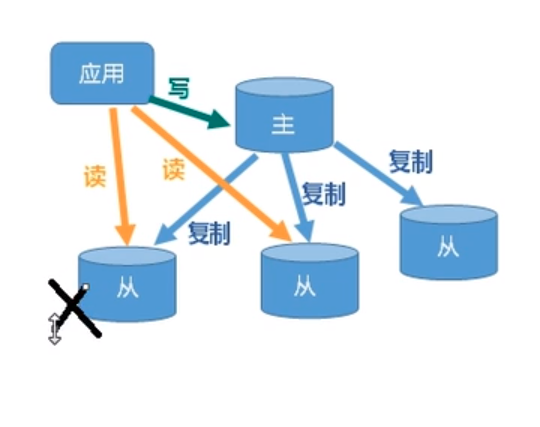
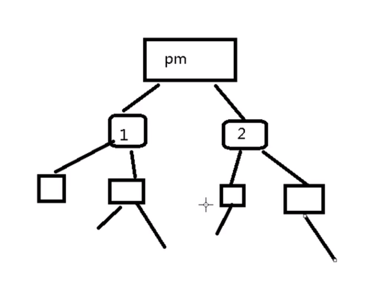
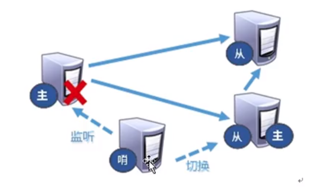
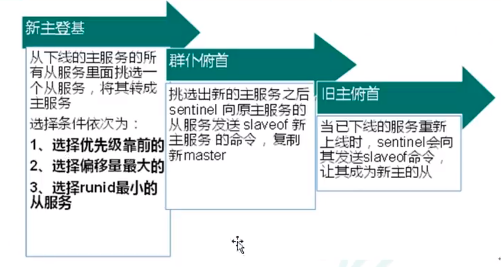
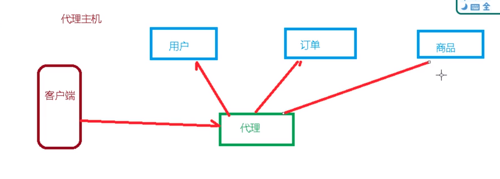
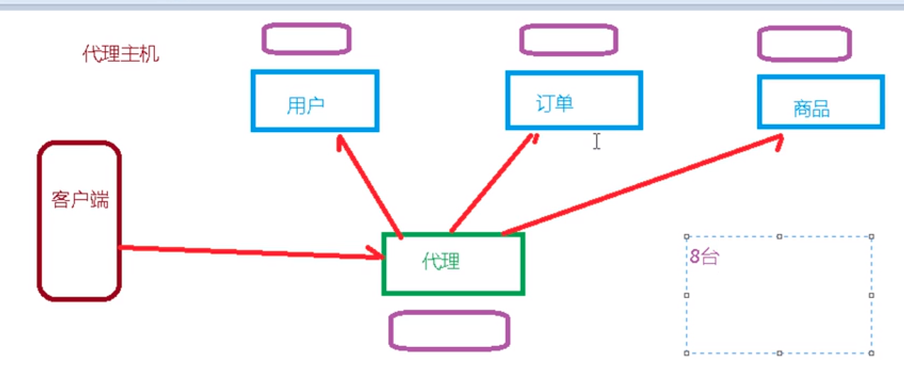
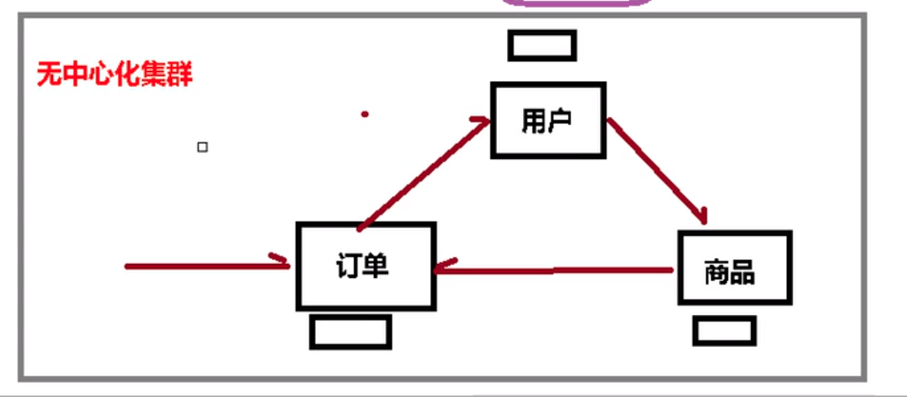

## 架构




## 特点

1. 读写分离 
2. 宰容快速恢复 从服务器宕机 其他从服务器可以工作
3. 一主多从   由于主机用于写  多主机引起混乱 

## 原理
1. 从服务器连接主服务器  发送数据sync同步消息
2. 主服务器接到 sync, 进行rdb持久化, 再发送给从服务器  (全量复制)
3. 从服务器收到 rdb 后, 更新数据库   
4. 主服务器更新后 发送同步消息给从服务器  (增量复制)


## 一主二仆
1. 创建 redis 文件夹  
2. 复制 redis.conf 到文件路径 
3. 配置一主两从的配置文件 即三个配置文件
4. 三个配置文件写入内容 
5. 执行命令 slaveof ip port

``` shell
// 查看关联关系
127.0.0.1:6379> info replication
# Replication
role:master
connected_slaves:0
master_replid:d882a5498d151015d2002b351fc16d842dbfe081
master_replid2:0000000000000000000000000000000000000000
master_repl_offset:0
second_repl_offset:-1
repl_backlog_active:0
repl_backlog_size:1048576
repl_backlog_first_byte_offset:0
repl_backlog_histlen:0
```


``` shell
➜  Desktop mkdir /tmp/redis
➜  Desktop sudo cp /etc/redis/redis.conf /tmp/redis 
[sudo] aris 的密码： 
➜  Desktop cd /tmp/redis      
// vim redis master file      
➜  redis vim redis_master_6379.conf
include /tmp/redis/redis.conf
pidfile /tmp/redis/redis_master_6379.pid
port 6379
// 文件不能为路径, 可通过 dir 配置
dbfilename redis_master_6379.rdb

// 同样配置其他
```

``` shell 
// 启动 redis 后 
➜  redis ps -ef | grep redis
redis       7143       1  0 23:55 ?        00:00:00 /usr/bin/redis-server 127.0.0.1:6379
root        7336    1803  0 23:57 ?        00:00:00 redis-server 127.0.0.1:6380
root        7353    1803  0 23:57 ?        00:00:00 redis-server 127.0.0.1:6381
```

``` shell 
// 连接从机 6381
➜  Desktop redis-cli -p 6381

// 执行 slave 操作  6379 指定为637 没有报错
// 事实上此时并没有开启  而此时从机会等待
127.0.0.1:6381> slaveof 127.0.0.1 637
OK

// 查看 主从信息
127.0.0.1:6381> info replication
# Replication
role:slave
master_host:127.0.0.1
master_port:637
// 主机不在线
master_link_status:down
master_last_io_seconds_ago:-1
master_sync_in_progress:0
slave_repl_offset:0
master_link_down_since_seconds:1635436836
slave_priority:100
slave_read_only:1
connected_slaves:0
master_replid:1d0e2c744e3f555cde58629d40eaad621573a5a0
master_replid2:0000000000000000000000000000000000000000
master_repl_offset:0
second_repl_offset:-1
repl_backlog_active:0
repl_backlog_size:1048576
repl_backlog_first_byte_offset:0
repl_backlog_histlen:0
```

``` shell 
// 连接从机 6380
➜  Desktop redis-cli -p 6380

// 执行 slave 操作
127.0.0.1:6381> slaveof 127.0.0.1 6379
OK

// 查看 主从信息
127.0.0.1:6380> info replication
# Replication
role:slave
master_host:127.0.0.1
master_port:6379
master_link_status:up
master_last_io_seconds_ago:10
master_sync_in_progress:0
slave_repl_offset:364
slave_priority:100
slave_read_only:1
connected_slaves:0
master_replid:8fc4d3276f6d006f907640c5fcc14f162847c859
master_replid2:0000000000000000000000000000000000000000
master_repl_offset:364
second_repl_offset:-1
repl_backlog_active:1
repl_backlog_size:1048576
repl_backlog_first_byte_offset:1
repl_backlog_histlen:364
```

``` shell
// 连接主机 6379
➜  Desktop redis-cli -p 6379

// 查看主机信息
127.0.0.1:6379> info replication
# Replication
role:master
connected_slaves:2
// 从服务器 online
slave0:ip=127.0.0.1,port=6380,state=online,offset=630,lag=0
slave1:ip=127.0.0.1,port=6381,state=online,offset=630,lag=1
master_replid:8fc4d3276f6d006f907640c5fcc14f162847c859
master_replid2:0000000000000000000000000000000000000000
master_repl_offset:630
second_repl_offset:-1
repl_backlog_active:1
repl_backlog_size:1048576
repl_backlog_first_byte_offset:1
repl_backlog_histlen:630
```

## 读写

``` shell 
// 读取从机
127.0.0.1:6380> keys *
(empty list or set)
127.0.0.1:6380> 
``` 

``` shell 
// 主机写入
127.0.0.1:6379> set k1 aris
OK

// 从机读取
127.0.0.1:6380> get k1
"aris"
```

``` shell
// 从机写入报错 
127.0.0.1:6380> set k2 uos
(error) READONLY You can't write against a read only replica. 
```


## 薪火相传


    

1. 一个主服务器管理少数子服务器, 让子服务器继续管理其他子服务器 
2. 写时, 主服务器同步给从服务器, 从服务器再分发给其他子服务器


``` shell
// 指定父服务器为主服务器
127.0.0.1:6380> slaveof 127.0.0.1 6379
OK

// 指定父服务器为子服务器
127.0.0.1:6381> slaveof 127.0.0.1 6380
OK

// 6380 子服务器
127.0.0.1:6380> info replication
# Replication
role:slave
master_host:127.0.0.1
master_port:6379
// 当前主服务器 为开启状态
master_link_status:up
master_last_io_seconds_ago:8
master_sync_in_progress:0
slave_repl_offset:154
slave_priority:100
slave_read_only:1
// 当前还连接了一个子服务器
connected_slaves:1
slave0:ip=127.0.0.1,port=6381,state=online,offset=154,lag=0
master_replid:83df3203d81e218ea269b7467c484351cfb9cd65
master_replid2:0000000000000000000000000000000000000000
master_repl_offset:154
second_repl_offset:-1
repl_backlog_active:1
repl_backlog_size:1048576
repl_backlog_first_byte_offset:1
repl_backlog_histlen:154

// 取消从属  当前作为子服务器
127.0.0.1:6381> slaveof no one
OK
```

## 反客为主 
监控主服务器的状态, 当主服务器异常时, 根据权重比将某个从服务器晋升为主服务器


哨兵模式



``` shell
// 哨兵配置文件
➜  redis vim redis_sentinel.conf
// 哨兵开启 主服务器别名 IP PORT 几个服务器同意后, 晋升为主服务器
sentinel master_server 127.0.0.1 6379 2 

// 启动哨兵
➜  redis sudo redis-sentinel /tmp/redis/redis_sentinel.conf
```

## 集群

解决问题: 
1. 容量不够  单台服务器可能写不进去了
2. 并发写操作   可能存在多个写操作


### 传统的主机代理方式

防止代理主机等宕机, 采用从机方式


采用此方式, 需要的服务器多
 

### 无中心化集群



1. 任何一台服务器都可以作为集群的入口
2. 水平扩容, 将数据N等分存入相应的节点
3. 可用性, 即使部分节点不可用, 其他部分也能正常使用


### 步骤
1. 配置redis所有服务器
2. redis-server 启动所有的程序
3. redis-cli --cluster create 启动集群
4. 


``` shell
// 创建配置文件
➜  redis sudo vim redis_master_6379.conf
include /tmp/redis/redis.conf
pidfile /tmp/redis/redis_master_6379.pid
port 6379
dbfilename db_master_6379.rdb
// 关闭保护模式
protected-mode no
// bind 地址为通配
bind *

// 允许开启集群模式
cluster-enabled yes
// 集群配置生成路径
cluster-config-file node-6379.conf
// 连接节点的超时时间
cluster-node-timeout 15000

// 开启集群, 同样配置其他6个
➜  redis sudo redis-server redis_master_6379.conf

// 查看 redis-server
➜  redis ps -ef | grep redis
root       17262    1777  0 17:35 ?        00:00:00 redis-server *:6379 [cluster]
root       17302    1777  0 17:35 ?        00:00:00 redis-server *:6380 [cluster]
root       17319    1777  0 17:35 ?        00:00:00 redis-server *:6381 [cluster]
root       17367    1777  0 17:35 ?        00:00:00 redis-server *:6389 [cluster]
root       17386    1777  0 17:36 ?        00:00:00 redis-server *:6390 [cluster]
root       17403    1777  0 17:36 ?        00:00:00 redis-server *:6391 [cluster]
```


``` shell 
// 开启集群 地址不能为loopback的地址 127.0.0.1
➜  redis redis-cli --cluster create --cluster-replicas 1 10.0.0.205:6379 10.0.0.205:6380 10.0.0.205:6381 10.0.0.205:6389 10.0.0.205:6390 10.0.0.205:6391
>>> Performing hash slots allocation on 6 nodes...
Master[0] -> Slots 0 - 5460
Master[1] -> Slots 5461 - 10922
Master[2] -> Slots 10923 - 16383
Adding replica 10.0.0.205:6390 to 10.0.0.205:6379
Adding replica 10.0.0.205:6391 to 10.0.0.205:6380
Adding replica 10.0.0.205:6389 to 10.0.0.205:6381
>>> Trying to optimize slaves allocation for anti-affinity
[WARNING] Some slaves are in the same host as their master
M: 18abae4d1f29d82e430122c67c9b51d473314d09 10.0.0.205:6379
   slots:[0-5460] (5461 slots) master
M: 79d95dfb29b5f69c509ddefbf19e3706462e4b38 10.0.0.205:6380
   slots:[5461-10922] (5462 slots) master
M: 65184af53ab397e2f749cd33c139f3db2d7f9998 10.0.0.205:6381
   slots:[10923-16383] (5461 slots) master
S: aab20960161e7157a4feaaedabf2848233a2d236 10.0.0.205:6389
   replicates 18abae4d1f29d82e430122c67c9b51d473314d09
S: cb69212c76acbfc3ccc971fd44eb358c8a7ce968 10.0.0.205:6390
   replicates 79d95dfb29b5f69c509ddefbf19e3706462e4b38
S: c8d42defb244dc18357ce1cda9daad2a5496ba75 10.0.0.205:6391
   replicates 65184af53ab397e2f749cd33c139f3db2d7f9998
Can I set the above configuration? (type 'yes' to accept): yes
>>> Nodes configuration updated
>>> Assign a different config epoch to each node
>>> Sending CLUSTER MEET messages to join the cluster
Waiting for the cluster to join
.........................................................

// 加入成功
>>> Performing Cluster Check (using node 127.0.0.1:6379)
M: 8b057dba87dbe2d9fa1588dead0ef6db5ecad4dd 127.0.0.1:6379
   slots:[0-5460] (5461 slots) master
   1 additional replica(s)
S: 300cfac0eaf6526ac81bde9bd11ef59dc6e9060b 127.0.0.1:6389
   slots: (0 slots) slave
   replicates 8b057dba87dbe2d9fa1588dead0ef6db5ecad4dd
S: 0d06ca936e7aaf96f1d95bff4fb21adc4bb33267 127.0.0.1:6391
   slots: (0 slots) slave
   replicates 6c788bcc7e2670ecf4979c37d63b53c11b10ac17
S: 674ceb38f01b30725ac360f31428a1267d5018f9 127.0.0.1:6390
   slots: (0 slots) slave
   replicates f534127523792d49ea94c02d7f5ba7e9cac2cc14
M: 6c788bcc7e2670ecf4979c37d63b53c11b10ac17 127.0.0.1:6381
   slots:[10923-16383] (5461 slots) master
   1 additional replica(s)
M: f534127523792d49ea94c02d7f5ba7e9cac2cc14 127.0.0.1:6380
   slots:[5461-10922] (5462 slots) master
   1 additional replica(s)
[OK] All nodes agree about slots configuration.
>>> Check for open slots...
>>> Check slots coverage...
[OK] All 16384 slots covered.
```


``` shell
// 查看集群信息
➜  redis redis-cli -c -p 6379
127.0.0.1:6379> cluster nodes
300cfac0eaf6526ac81bde9bd11ef59dc6e9060b 127.0.0.1:6389@16389 slave 8b057dba87dbe2d9fa1588dead0ef6db5ecad4dd 0 1635592401708 1 connected
0d06ca936e7aaf96f1d95bff4fb21adc4bb33267 127.0.0.1:6391@16391 slave 6c788bcc7e2670ecf4979c37d63b53c11b10ac17 0 1635592401000 6 connected
674ceb38f01b30725ac360f31428a1267d5018f9 127.0.0.1:6390@16390 slave f534127523792d49ea94c02d7f5ba7e9cac2cc14 0 1635592401000 5 connected
8b057dba87dbe2d9fa1588dead0ef6db5ecad4dd 127.0.0.1:6379@16379 myself,master - 0 1635592399000 1 connected 0-5460
6c788bcc7e2670ecf4979c37d63b53c11b10ac17 127.0.0.1:6381@16381 master - 0 1635592402709 3 connected 10923-16383
f534127523792d49ea94c02d7f5ba7e9cac2cc14 127.0.0.1:6380@16380 master - 0 1635592400706 2 connected 5461-10922
```