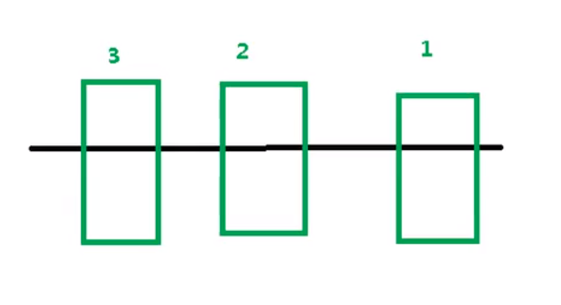
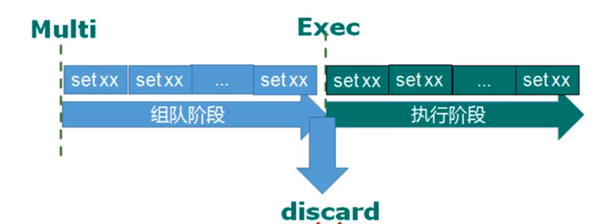
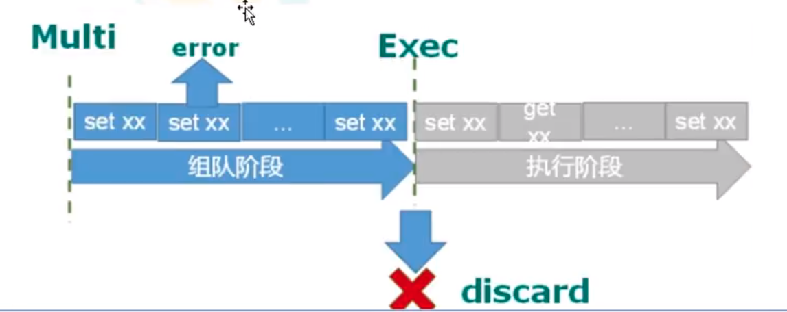
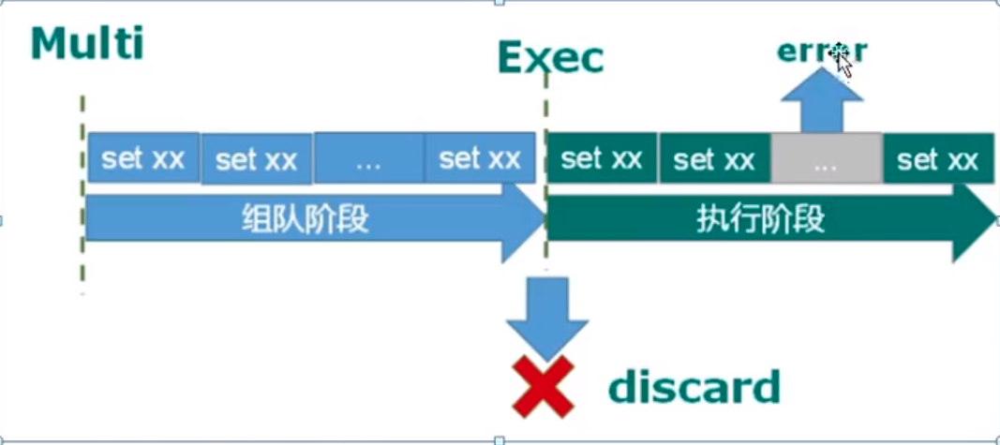
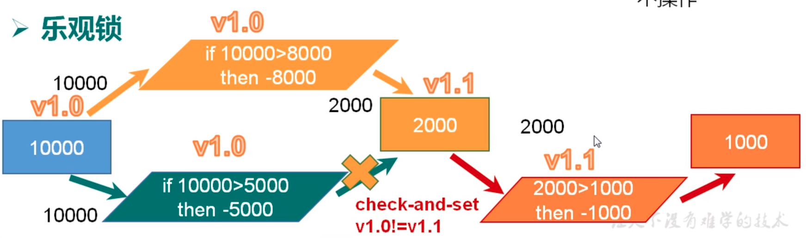
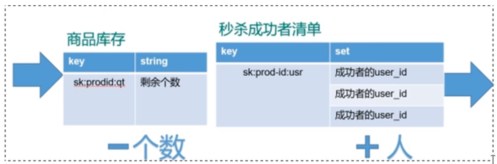

## 说明 
将操作进行序列化    串联多个命令  防止被多个命令打断    

## 特性
1. 单独的隔离性, 序列化执行 不会被其他事务打断
2. 队列没有提交前 都不会被执行
3. 不保证原子性 如果一条命令执行失败 其他命令也会执行  无法回滚



3 2 1 顺序执行   不会被插队打断

## 操作 



1. Multi  将命令放在队列中, 但不会执行, 直到exec
2. Exec  执行队列队列 
3. Discard  放弃队列


``` shell
// 开启事务
127.0.0.1:6379> multi
OK
// 添加事务
127.0.0.1:6379> set k1 aris
QUEUED
127.0.0.1:6379> set k2 uos
QUEUED
// 执行事务
127.0.0.1:6379> exec
1) OK
2) OK

// 放弃事务
127.0.0.1:6379> discard
OK
```


## 异常

1. 组队异常时, 所有事务都不会被执行



``` shell
// 开启事务
127.0.0.1:6379> multi
OK
127.0.0.1:6379> set k1 aris
QUEUED
// 设置出错
127.0.0.1:6379> set uos
(error) ERR wrong number of arguments for 'set' command
// 组队异常, 因此都不会被执行
127.0.0.1:6379> exec
(error) EXECABORT Transaction discarded because of previous errors.
```


2. 执行阶段出错, 只有失败的这个不会被执行



``` shell
// 开启事务
127.0.0.1:6379> multi
OK
127.0.0.1:6379> set k1 aris
QUEUED
127.0.0.1:6379> INCR k1 
QUEUED
127.0.0.1:6379> set k2 uos
QUEUED
127.0.0.1:6379> exec
1) OK
2) (error) ERR value is not an integer or out of range
3) OK
```


## 锁  

1. 悲观锁  

每次操作前, 先上锁, 行锁 表锁   
效率低


2. 乐观锁

所有操作都能读到版本数据   
一个操作时, 更新版本号    
另外的操作前, 比较数据库的版本号， 版本不相等, 则不能操作  




watch监视一个或多个key, 如果这个key被其他命令改变, 则事务打断


``` shell
127.0.0.1:6379> set k1 1
OK
// 执行监听
127.0.0.1:6379> watch k1
OK
127.0.0.1:6379> multi
OK
// 加 10
127.0.0.1:6379> INCRBY k1 10
QUEUED
127.0.0.1:6379> exec
1) (integer) 11


127.0.0.1:6379> watch k1
OK
127.0.0.1:6379> multi
OK
127.0.0.1:6379> INCRBY  k1 20
QUEUED
// 上面的操作已经更新了key 此事务会被打断
127.0.0.1:6379> exec
(nil)
```


## 秒杀商品 

