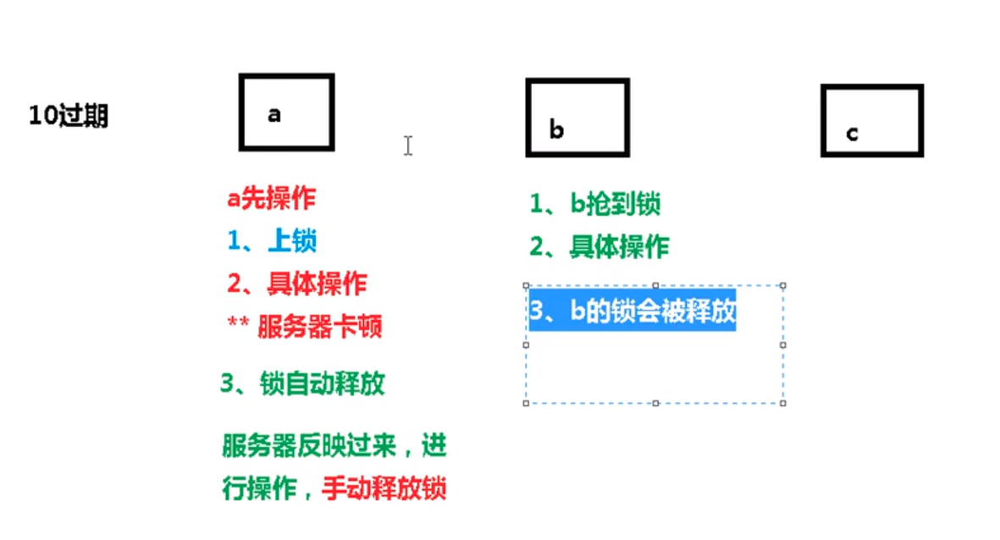
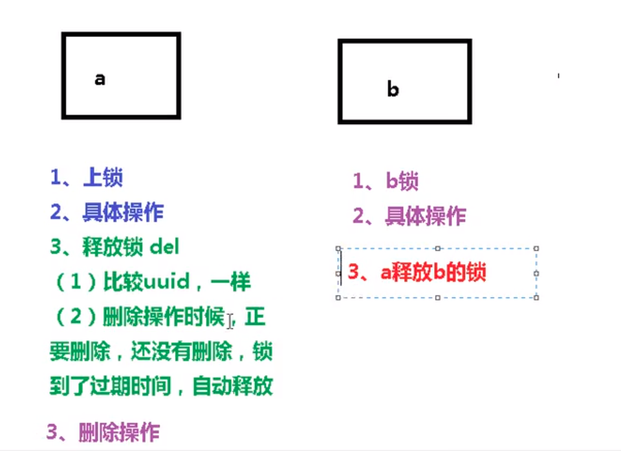

## 说明
单体机器部署演化成分布式集群系统时, 分布式系统多线程, 多进程部署在其他机器上, 此时需要使用锁机制通知其他系统    
对所有机器都知道

## 分布式锁主流方案:
1. 数据库分布式锁
2. redis分布式锁   (效率最高)
3. zookeeper锁  (可靠性最高)


## redis分布式锁
``` shell

setnx
// 设置锁的过期时间
// 加锁与超时设为同一步骤, 防止上锁后, 还没加过期时间, 服务器宕机, 导致锁无法过期
// 设置uuid 防止卡顿时, 当前的进程休眠后, 释放了他人的锁 
setnx k1 uuid nx ex 100
```



使用lua脚本解决此问题
