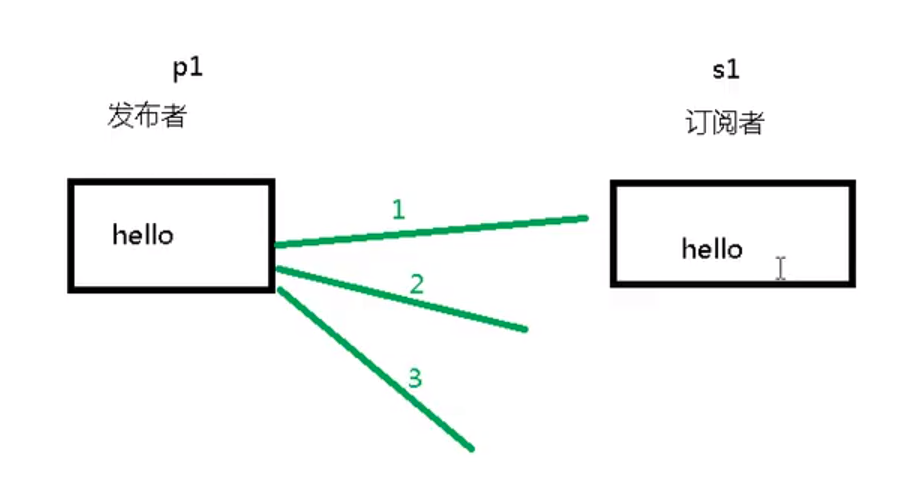

## 说明

redis 的订阅者可以订阅任意 频道 的消息




``` shell
// 订阅消息
127.0.0.1:6379> SUBSCRIBE c1
Reading messages... (press Ctrl-C to quit)
1) "subscribe"
2) "c1"
3) (integer) 1

// 接收到 发布者发布的消息
1) "message"
2) "c1"
3) "hello"
```

``` shell
// 发布者
127.0.0.1:6379> PUBLISH c1 bye
(integer) 1
```
