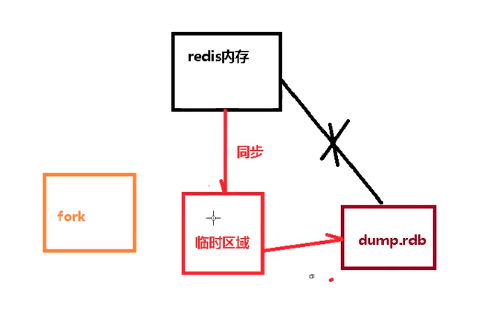

## 说明 
持久化存储: 1. RDB AOF

## RDB 
指定时间间隔内. 将内存中的数据集快照写入磁盘  

1. redis中fork一个进程, 将数据写到临时文件后, 在替换数据库文件 

 
 

2. 写时复制 

### rdb配置文件 
dbfilename dump.rdb  数据库文件名称       
rdbchecksum yes    检查数据完整性              
stop-writes-on-bgsave-error yes              
save 900 1   写操作的次数   900s 一个key 发生变化 做一次持久化     

### 劣势 
1. fork 操作耗费内存 
2. 最后一次, 如果此时崩溃, 数据丢失 