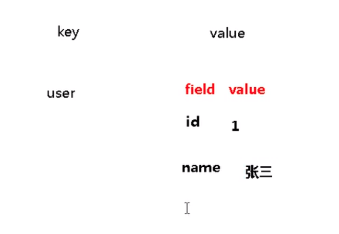
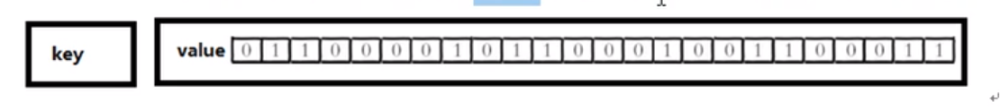

## 说明

redis 有吴忠基础数据结构 
1. string
2. set (无序集合)
3. zset (有序集合)
4. hash (字典)
5. list (列表)


## 数据库库
1. redis 默认有16个数据库    
2. 使用select命令进行切换
``` shell
➜  Desktop redis-cli 
127.0.0.1:6379> SELECT 1
OK
127.0.0.1:6379[1]> SELECT 0
OK
```
3. 所有库使用同一个密码
4. dbsize 当前key数量
5. flushdb 清空当前库
6. flushall 清空所有库
``` shell
127.0.0.1:6379> set name aris
OK
127.0.0.1:6379> DBSIZE
(integer) 1
127.0.0.1:6379> flushdb
OK
127.0.0.1:6379> DBSIZE
(integer) 0
```

## 键

``` shell
// 添加key
127.0.0.1:6379> set k1 aris
OK
127.0.0.1:6379> set k2 test
OK
// 列出所有keys
127.0.0.1:6379> keys *
1) "k1"
2) "k2"
// 删除key
127.0.0.1:6379> del k2
(integer) 1
127.0.0.1:6379> keys *
1) "k1"
// 设置过期时间
127.0.0.1:6379> EXPIRE k1 3
(integer) 1
127.0.0.1:6379> keys *
(empty list or set)
127.0.0.1:6379> 
```


``` shell
// 添加key
127.0.0.1:6379> set k1 aris
OK
// 设置过期时间
127.0.0.1:6379> EXPIRE k1 20
(integer) 1
// 大小写敏感
127.0.0.1:6379> TTL K1
(integer) -2
// 查看过期时间
127.0.0.1:6379> TTL k1
(integer) 8
127.0.0.1:6379> 
```


## string
二进制安全, 意思是内容如果可以用字符串表示都可以保存， 例如jpg图片   
一个string的value可以到512M   
操作是原子性的，因为redis是单线程

底层类似于 Java 的 ArrayList, 预分配

``` shell
// 设置 k1
127.0.0.1:6379> set k1 aris
OK
// 往对应的value后加
127.0.0.1:6379> append k1 -test
(integer) 9
// 长度
127.0.0.1:6379> STRLEN k1
(integer) 9
// 覆盖
127.0.0.1:6379> set k1 aris
OK
// 如果存在，则不会覆盖
127.0.0.1:6379> SETNX k1 test
(integer) 0
127.0.0.1:6379> get k1
"aris"
``

``` shell
// +1 
127.0.0.1:6379> INCR k2
(integer) 2
127.0.0.1:6379> GET k2
"2"
// -1
127.0.0.1:6379> DECR k2
(integer) 1
// +2
127.0.0.1:6379> INCRBY k2 2
(integer) 3
// -2
127.0.0.1:6379> DECRBY k2 2
(integer) 1
```

``` shell
// 设置多个值
127.0.0.1:6379> MSET k1 aris k2 uos k3 test
OK
127.0.0.1:6379> MGET k1 k2 k3
1) "aris"
2) "uos"
3) "test"
// 未设置成功，只要有一个存在，则其他的都失败
127.0.0.1:6379> MSETNX k4 test k5 test k1 test
(integer) 0
127.0.0.1:6379> MGET k1 k2 k3 k4 k5
1) "aris"
2) "uos"
3) "test"
4) (nil)
5) (nil)
```

``` shell
127.0.0.1:6379> append k1 -test
(integer) 9
// 获取字符串的 index
127.0.0.1:6379> GETRANGE k1 0 3
"aris"
127.0.0.1:6379> set k6 100000
OK
// 可以用来获取数字
127.0.0.1:6379> GETRANGE k6 0 3
"1000"
```

``` shell
// 设置过期时间
127.0.0.1:6379> SETEX k7 20 test
OK
127.0.0.1:6379> TTL k7
(integer) 14
127.0.0.1:6379> GET k7
"test"
// 新值换旧值
127.0.0.1:6379> GETSET k1 test
"aris-test"
127.0.0.1:6379> GET k1
"test"
```

## list 
本质上是一个双向链表   
值全部取完 key消失   
lpush 从左边放入   
rpush 从右边插入   
rpoplpush 从最右边取一个值 插入最左边    没有lpoprpush
lrange key start stop 读取key的index value   

数据结构是个 quickList            
数据较少的时候  是一个连续内存存储  称为ziplist


当数据多时, 存在多个压缩链表, 用双向指针串起来 


``` shell 
lpush v1 v2 v3

v1
v2 v1 
v3 v2 v1
```

``` shell
rpush v1 v2 v3

      v1 
   v1 v2 
v1 v2 v3
```

``` shell
// 从左边插入列表
127.0.0.1:6379> lpush k1 aris uos test
(integer) 3
// 从左边插入, 最后插入的值在最左边
127.0.0.1:6379> LRANGE k1 0 -1
1) "test"
2) "uos"
3) "aris"
// 从最左边取出一个值 
127.0.0.1:6379> LPOP k1
"test"
// 从最右边取出一个值
127.0.0.1:6379> RPOP k1
"aris"
// 每取出一个值 就少一个元素
127.0.0.1:6379> LRANGE k1 0 -1
1) "uos"
```


``` shell
127.0.0.1:6379> rpush k1 aris uos test
(integer) 3
127.0.0.1:6379> LRANGE k1 0 -1
1) "aris"
2) "uos"
3) "test"
127.0.0.1:6379> lpush k2 aris uos test
(integer) 3
127.0.0.1:6379> LRANGE k2 0 -1
1) "test"
2) "uos"
3) "aris"
// 从k2 最右边取出一个值  插入 k1 最左边
127.0.0.1:6379> RPOPLPUSH k2 k1 
"aris"
127.0.0.1:6379> LRANGE k1 0 -1
1) "aris"
2) "aris"
3) "uos"
4) "test"
```

``` shell
// 从最右边插入
127.0.0.1:6379> rpush k1 aris uos test
(integer) 3
// 根据下标查找值
127.0.0.1:6379> LINDEX k1 1
"uos"
// 长度
127.0.0.1:6379> LLEN k1
(integer) 3
// 在某个值 而不是key 之前或之后插入值
127.0.0.1:6379> LINSERT k1 BEFORE "uos" "UOS"
(integer) 4
// 查询 0 - 2 值
127.0.0.1:6379> LRANGE k1 0 2
1) "aris"
2) "UOS"
3) "uos"
// 从最左边删除 1 个 UOS
127.0.0.1:6379> LREM k1 1 UOS
(integer) 1
// 从最左边开始 设置 第2个值 为 TEST
127.0.0.1:6379> LSET k1 2 TEST
OK
127.0.0.1:6379> LRANGE k1 0 -1
1) "aris"
2) "uos"
3) "TEST"
```

## set

与list类似, 只是元素不能重复, 并且是无序的   
底层是 hash 表

``` shell
// 添加 set
127.0.0.1:6379> sadd k1 aris uos test
(integer) 3
// 查看其中的元素
127.0.0.1:6379> SMEMBERS k1
1) "test"
2) "uos"
3) "aris"
// 查看 value 是否是其中的元素
127.0.0.1:6379> SISMEMBER k1 aris
(integer) 1
// value 不是其中的元素返回 0
127.0.0.1:6379> SISMEMBER k1 ARIS
(integer) 0
// 返回元素的个数
127.0.0.1:6379> SCARD k1
(integer) 3
// 删除 set 中的元素
127.0.0.1:6379> SREM k1 aris uos
(integer) 2
127.0.0.1:6379> SMEMBERS k1
1) "test"
// 随机从 set 中获取一个元素
127.0.0.1:6379> SPOP k1
"test"
// 当为空时 key 删除
127.0.0.1:6379> keys *
(empty list or set)
```

``` shell
// 添加元素
127.0.0.1:6379> sadd k1 aris uos test
(integer) 3
// 随机取出 2 个值, 但不删除
127.0.0.1:6379> SRANDMEMBER k1 2
1) "test"
2) "aris"
127.0.0.1:6379> sadd k2 aris ubuntu deepin 
(integer) 3
// 从 k2 中取出一个值 deepin 加入 k1
127.0.0.1:6379> SMOVE k2 k1 deepin
(integer) 1
127.0.0.1:6379> SMEMBERS k1
1) "deepin"
2) "test"
3) "uos"
4) "aris"
// 查看 k1 k2 交集
127.0.0.1:6379> SINTER k1 k2 
1) "aris"
// 查看 k1 k2 并集
127.0.0.1:6379> SUNION k1 k2
1) "test"
2) "aris"
3) "uos"
4) "deepin"
5) "ubuntu"
// 查看 k1 k2 差集
127.0.0.1:6379> SDIFF k1 k2
1) "deepin"
2) "test"
3) "uos"
```

## hash

键值对集合, 只是值是一个 field 与 value 的映射表   
可以理解为 key 和 object对象的 hash




``` shell
// 添加 key field value
127.0.0.1:6379> hset k1 name aris
(integer) 1
127.0.0.1:6379> hset k1 age 26 
(integer) 1
// 根据 key field 获取 value
127.0.0.1:6379> hget k1 name
"aris"
// 列出 key 中所有的 field
127.0.0.1:6379> HKEYS k1
1) "name"
2) "age"
// 列出所有的值
127.0.0.1:6379> HVALS k1
1) "aris"
2) "26"
// 删除某个 key field
127.0.0.1:6379> HDEL k1 name 
(integer) 1
// key 中添加 多个 field value
127.0.0.1:6379> hmset k2 name test system uos version 1
OK
// 查看 field 是否存在与 key 中
127.0.0.1:6379> HEXISTS k2 version
(integer) 1
// value 添加 步长
127.0.0.1:6379> HINCRBY k1 age 2
(integer) 28
// 当 field 不存在时 才添加
127.0.0.1:6379> hsetnx k1 age 2
(integer) 0
```

## Zset 
与set类似, 都是没有重复成员的     
是有序的 每个成员都包含一个 score score可以重复       

zset是个 map field value 只是 value 是 score   
跳跃表  


``` shell
// 添加zset
127.0.0.1:6379> zadd k1 1 aris 100 uos 200 test
(integer) 3
// 添加分数显示 key
127.0.0.1:6379> ZRANGE k1 0 -1 WITHSCORES
1) "aris"
2) "1"
3) "uos"
4) "100"
5) "test"
6) "200"
// 仅显示部分 
127.0.0.1:6379> ZRANGEBYSCORE k1 1 100 WITHSCORES
1) "aris"
2) "1"
3) "uos"
4) "100"
// 从大到小 排序
127.0.0.1:6379> ZREVRANGE k1 0 -1 WITHSCORES
1) "test"
2) "200"
3) "uos"
4) "100"
5) "aris"
6) "1"
// 增加SCORE 
127.0.0.1:6379> ZINCRBY k1 100 aris
"101"
127.0.0.1:6379> ZRANGE k1 0 -1
1) "uos"
2) "aris"
3) "test"
// score 的个数
127.0.0.1:6379> ZCOUNT k1 0 200
(integer) 3
// 位置
127.0.0.1:6379> ZRANK k1 aris
(integer) 1
```

## bitmap

二进制字节存储  
第一次存储时, 偏移量大, 初始化过程执行得慢 



bitmap和set存储空间的比价


``` shell
// 设置 第10 位 1
127.0.0.1:6379> setbit k1 10 1
(integer) 0
// 0 - 3 字节含有 1 个比特位 为1  每个字节8比特
127.0.0.1:6379> bitcount k1 0 3
(integer) 1
```


``` shell
bitop 
```