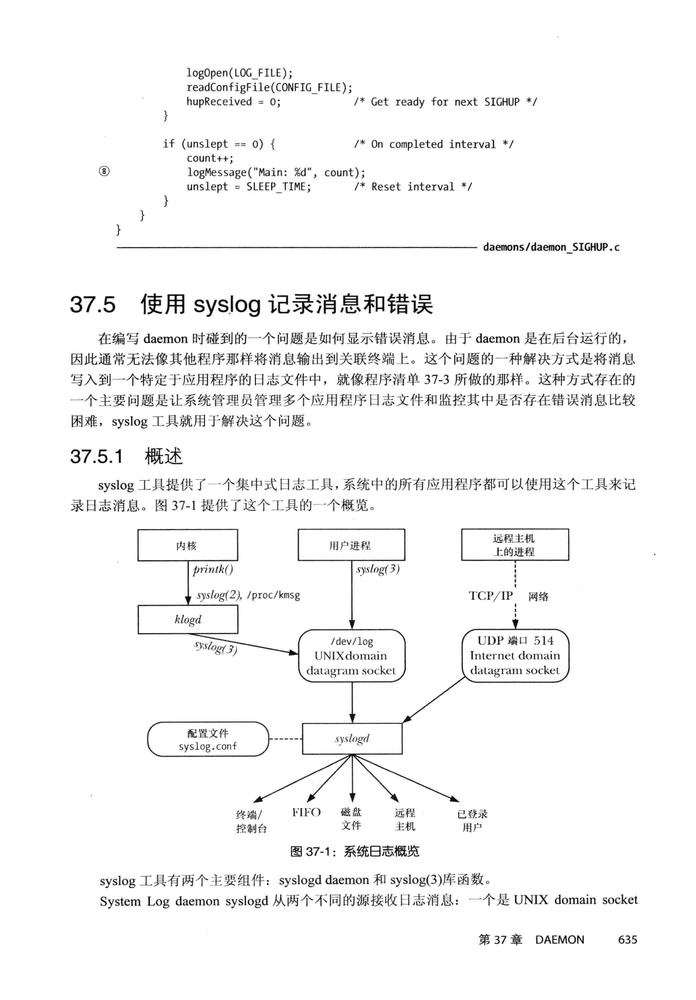

## 说明
syslog 




## syslogd 服务

配置文件为 /etc/syslog.conf

控制台输出路径 /dev/console 

``` shell
➜  ~ ls -al /dev/console 
crw--w---- 1 root tty 5, 1 8月  18 22:36 /dev/console
```

内核日志输出路径 /dev/kmsg
``` shell
➜  ~ ls -l /dev/kmsg 
crw-r--r-- 1 root root 1, 11 8月  18 22:36 /dev/kmsg
```

