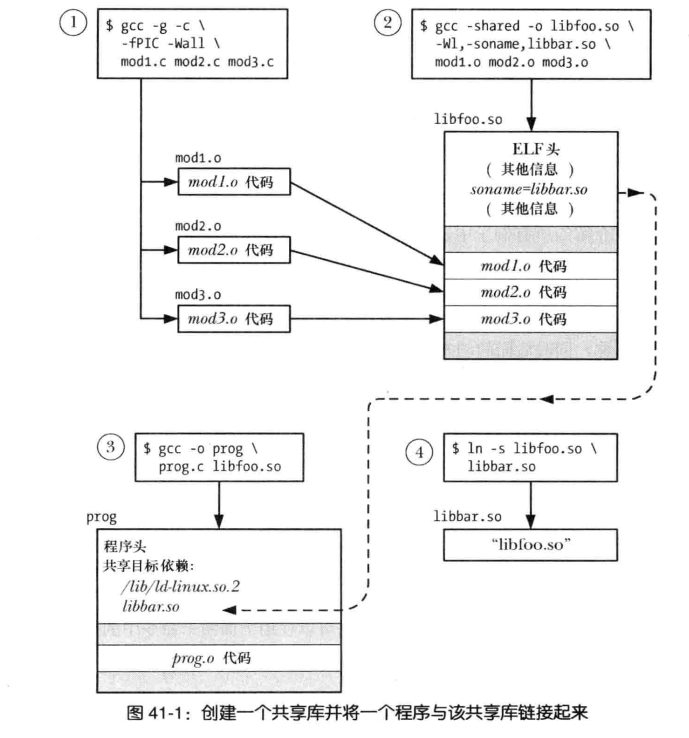
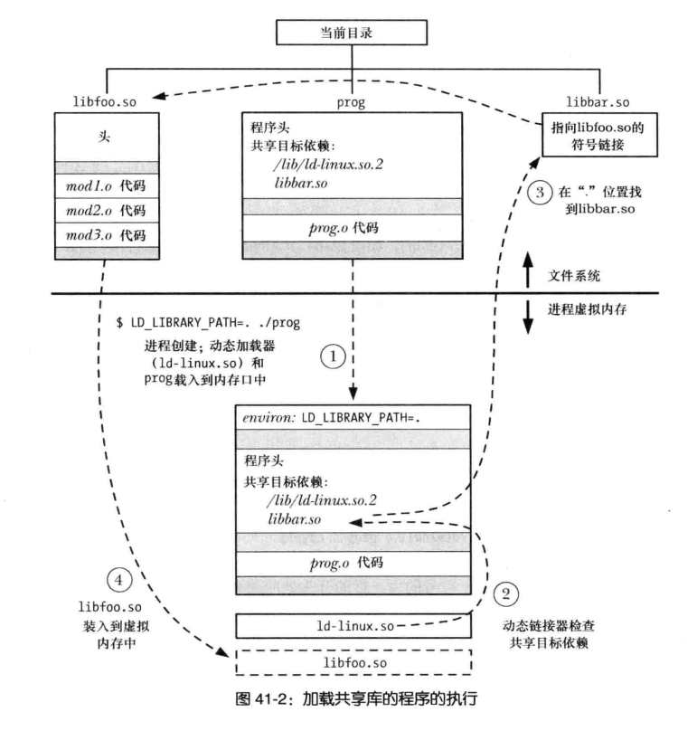

## 名词 
动态加载器:     
动态链接器:   

## 命令 
ar   
nm     
readelf     
objump   
ldd     


## 静态库
``` shell
# cc -c 编译各自的文件, 不链接
❯ cc -g -c static_01.c static_02.c 
# ar r 将目标文件插入归档文件, 并替换同名文件
❯ ar r libstatic.a static_01.o static_02.o

# 显示静态库中归档文件的目录
❯ ar tv libstatic.a
rw-r--r-- 0/0   3536 Jan  1 08:00 1970 static_01.o
rw-r--r-- 0/0   3536 Jan  1 08:00 1970 static_02.o

# 链接
cc -g -o main -L. use_static.cc libstatic.a(或者lstatic也可以)
```

## 动态库
1. 所有进程共享同一个 被加载进内存的 共享库的副本
2. 代码是多进程共享的, 但是全局变量和静态变量是 每个进程独有的 
3. 共享库编译时必须使用位置独立的代码
4. 运行时需要执行符号重定位 
``` shell
# 生成模块
# fPIC: https://blog.csdn.net/foxriver_gjg1989/article/details/104432575
# Global offset table: https://www.cntofu.com/book/46/linked_and_loader/gothe_plt_yuan_li_jian_xi.md
❯ g++ -g -c -fPIC static_01.cc
# 生成动态库 
❯ g++ -g -shared -o libstatic.so static_01.o

# 查看是否包含了 fPIC
# nm 用于读取符号信息  
❯ nm libstatic.so
0000000000004028 b completed.0
                 w __cxa_finalize@GLIBC_2.2.5
0000000000001040 t deregister_tm_clones
0000000000004000 d _GLOBAL_OFFSET_TABLE_

# 查看 elf 文件的信息
❯ readelf -a libstatic.so
ELF 头：
  Magic：  7f 45 4c 46 02 01 01 00 00 00 00 00 00 00 00 00 
  类别:                              ELF64
  数据:                              2 补码，小端序 (little endian)
  Version:                           1 (current)
  OS/ABI:                            UNIX - System V
  ABI 版本:                          0
  类型:                              DYN (共享目标文件)
  系统架构:                          Advanced Micro Devices X86-64
  版本:                              0x1
  入口点地址：              0x0
  程序头起点：              64 (bytes into file)


# 通知动态链接器 寻找 动态库地址的 环境变量
❯ export LD_LIBRARY_PATH=.  

# 可在编译时使用 soname, 可执行文件通常记录的是 soname 信息 
❯ g++ -g -shared -Wl,-soname,libsoname.so -o libstatic.so static_01.o
❯ g++ -g -o main use_static.cc libstatic.so
❯ readelf -a libstatic.so
Dynamic section at offset 0x2db8 contains 30 entries:
  标记        类型                         名称/值
 0x0000000000000001 (NEEDED)             共享库：[libsoname.so]

# 必须手动创建 soname 文件
❯ ln libstatic.so libsoname.so
❯ export LD_LIBRARY_PATH=.;./main
this is a static_01 lib

# 查看所有所需动态库 
❯ ldd main
        linux-vdso.so.1 (0x00007ffc5df1d000)
        libsoname.so => ./libsoname.so (0x00007fcb4d472000)


# 主要版本 和 次要版本  和 链接器名称   
# 一般 soname 是主要版本 指向真实的次要版本  
# 主要版本(soname) -> 次要版本 (真实名称)
libsoname.so.1 -> libsoname.so.1.0.1   
# 链接器名称 -> 主要版本 (soname)
libsoname.so -> libsoname.so.1

# 标准库安装目录   
# /usr/lib 大部分库的安装目录  
# /lib 系统启动用到的库   
# /usr/local/lib 非标准库 或者 实验库   
# /etc/ld.so.conf 指定的目录  
# ldconfig 可以刷新缓存, 以便快速找到 链接库 

# 寻找编译路径参数 
# -rpath 指定运行时 库搜索路径   
# LD_RUN_PATH 指定路径, 比LD_LIBRARY_PATH低 (--enable-new-dtags)
# LD_RPATH (默认 比LD_LIBRARY_PATH高)
# -rpath,'$ORIGIN'/lib
```

## 高级特性 
### dlopen APT
1. dlopen API 编译时, 需要带上 -ldl 参数 
2. RTLD_NOW  RTLD_LAZY  RTLD_GLOBAL RTLD_LOCAL RTLD_NOLOAD RTLD_NODELETE
3. RTLD_DEFAULT(先在主程序中查找函数符号, 再按加载顺序查找), RLTD_NEXT(查找下一个) 

### 符号可见性
1. static 使得函数 仅针对该文件可用 
2. __attribute__ ((visibility("hidden"))), 共享库可见, 外部不可见 
3. 


## 动态库加载  
1. 编译步骤 


2. 加载步骤 



## 参考文献 
Linux加载启动可执行程序的过程（一）内核空间加载ELF的过程:  
https://blog.csdn.net/chrisnotfound/article/details/80082289

