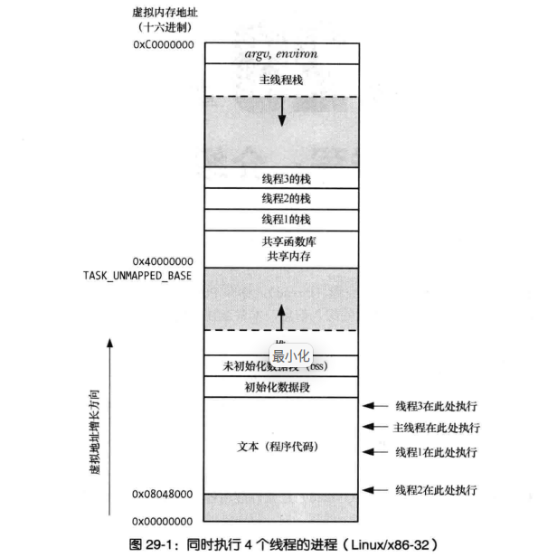

## 线程布局
  
线程在虚拟地址空间的布局

## 线程与error
1. pthread_create等线程函数成功返回0, 失败返回正数, 可直接通过 strerr(int) 来打印错误信息
2. 每个线程都有自己的errno

## 线程函数
1. pthread_create(pthread_t &id, const pthread_attr_t *arr, void*(*start)(void*), void* arg) 创造线程
2. pthread_join(pthread_t id, void **result) 等待线程终止, 线程返回值从 void* 转化为int时, 需要额外注意 PTHREAD_CANCELED， 返回值应该区分   
与 waitpid 的区别:   
线程调用 pthread_create 后, 每个线程的关系是相等的, 可以通过任意线程调用 pthread_join 创建关联, 而进程间有父子关系, 只能父进程 waitpid 子进程  
3. pthread_exit(void *) 可在线程的函数中调用, 相当于 return, 主线程退出不影响其他线程运行 
4. pthread_self() 获取线程 id 
5. pthread_equal(pthread_t t1, pthread_t t2), 比较线程是否相等, 不能直接 == 
6. pthread_detach(pthread_t id) 线程分离, 当主线程 exit 或者 return 时, 进程内的所有线程都会终止
7. pthread_cancel(pthread_t id) 线程取消   
默认是达到取消点取消线程, 取消点是某些函数 accept 

## 线程与进程 
1. 线程共享数据方便, 进程需要通过管道等方式   
2. 线程创建要快于进程, 线程上下文切换要小于进程 
3. 线程需要保证线程安全 
4. 一个线程出现问题, 整个进程都无法正常运行 

## 互斥量函数 
1. pthread_mutex_lock (pthread_mutex_t *mu) 获取锁 
2. pthread_mutex_unlock (pthread_mutex_t *mu) 释放锁 
3. pthread_mutex_trylock (pthread_mutex_t *mu) 如果被锁住, 则返回失败 
4. pthread_mutex_timedlock
5. pthread_mutex_int(pthread_mutex_t *mu, pthread_mutexattr_t *attr) 初始化锁  
PTHREAD_MUTEX_INITIALIER 只能对静态分配, 且使用默认属性  
6. pthread_destory(pthread_mutex_t *mu) 释放属性 

## 线程与信号
1. 信号发明要比线程早很久, 很对信号是针对单线程的 
2. 当某个线程使用 sigaction 创建信号处理函数时, 任意线程可能都会取调用处理函数 
3. 信号发送针对线程的三种情况: 1. 硬件产生的信号 SIGSEGV   2. 线程试图对关闭的管道执行写操作 SIGPIPE  3. 调用 pthread_kill pthread_sigqueue   其他的机制都是面向进程的 
4. 信号掩码是针对线程的  