## 架构图
传统网络架构图: 
可能存在资源浪费  

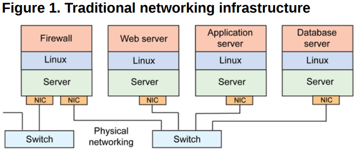

虚拟化架构图

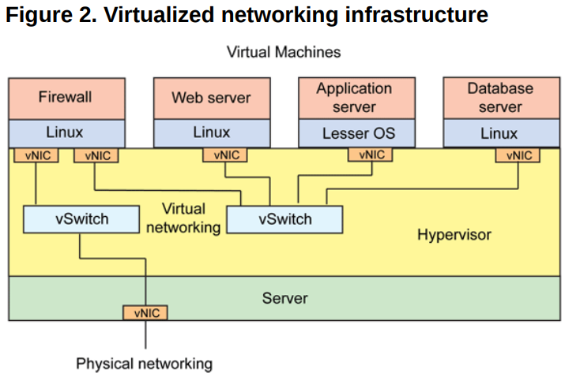

这一整套虚拟网络的模块都可以独立出去，由第三方来完成，如其中比较出名的一个解决方案就是 Open vSwitch（OVS）。

## 架构图

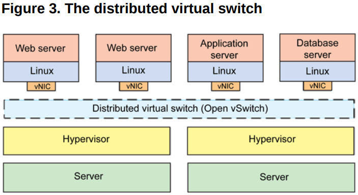

## 虚拟化设备

### tun/tap/veth
tap工作在OSI二层，tun在三层。
基于tap驱动，则可以使得虚拟机的vNIC与tap相连，就像NIC与eth设备一样。

包含两个驱动： 字符驱动(内核与用户层数据传输)   网卡驱动(TCP/IP协议栈中传输处理)

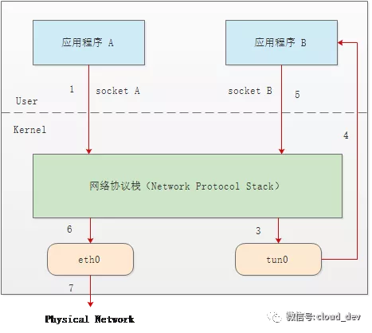

### bridge
工作在二层，但是需要为其设置IP，对于上层路由器，该设备位于子网中，连接在其上的设备不需要设置ip

#### vlan
虚拟局域网, 使用tag id避免广播造成的广播风暴.

传统的lan,     
频繁发生广播 arp dhcp rip等
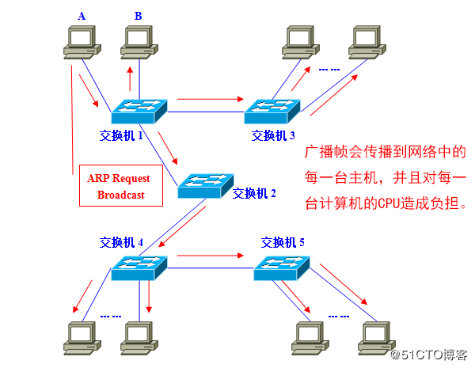

vlan   
三层交换器一般不分割广播域，一般是二层进行分割    
两个广播域通信可采用vlan间路由
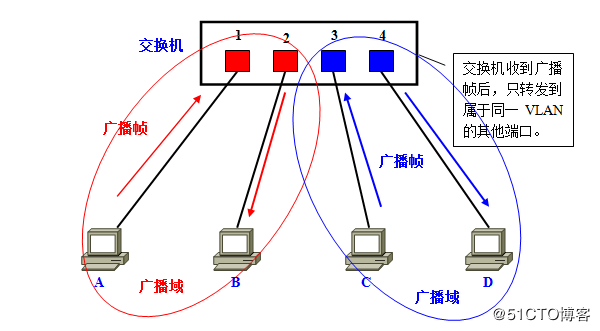

vlan间访问
1. 访问链接 : 静态链接 和 动态链接
2. 汇聚链接

###### 链接访问
静态链接    
手动指定 vlan和端口的关系    
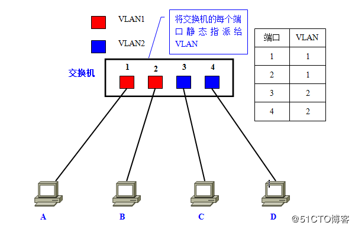

动态链接
1. 基于MAC地址的VLAN (二层)       
将虚拟接口灵活可变地绑定到端口上
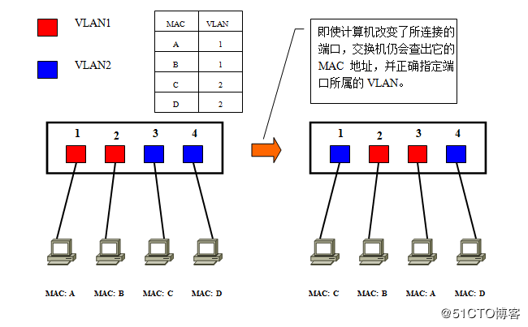  

2. 基于子网的VLAN  (三层)     
只要计算机IP不变，就可以指定为远vlan

3. 基于用户的VLAN (四层及以上)

###### 汇聚链接
汇聚链路上流通着多个VLAN的数据，自然负载较重。因此，在设定汇聚链接时，有一个前提就是必须支持100Mbps以上的传输速度。

1. 跨多交换机的vlan   
不合理但可行的布局  非汇聚
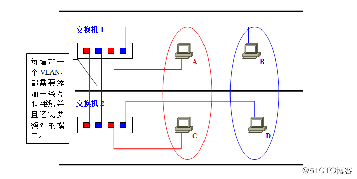
   
合理布局 汇聚   
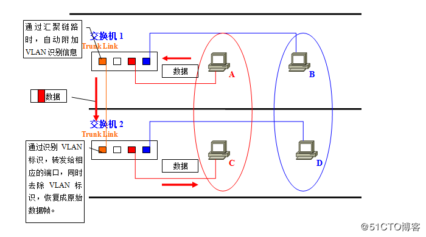

2. 汇聚方式

IEEE802.1Q     
TPID的值，固定为0x8100。交换机通过TPID，来确定数据帧内附加了基于IEEE802.1Q的VLAN信息。而实质上的VLAN ID，是TCI中的12位元。
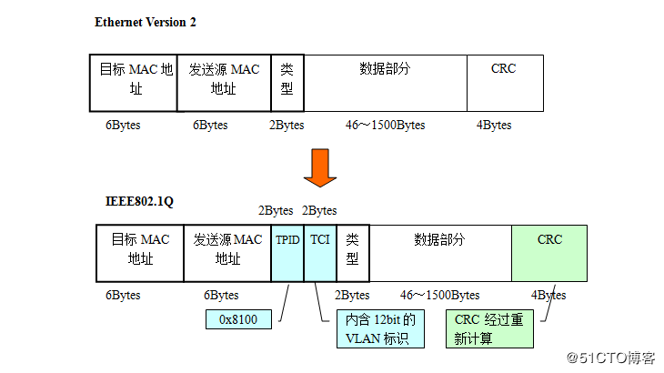

ISL（Inter Switch Link）     
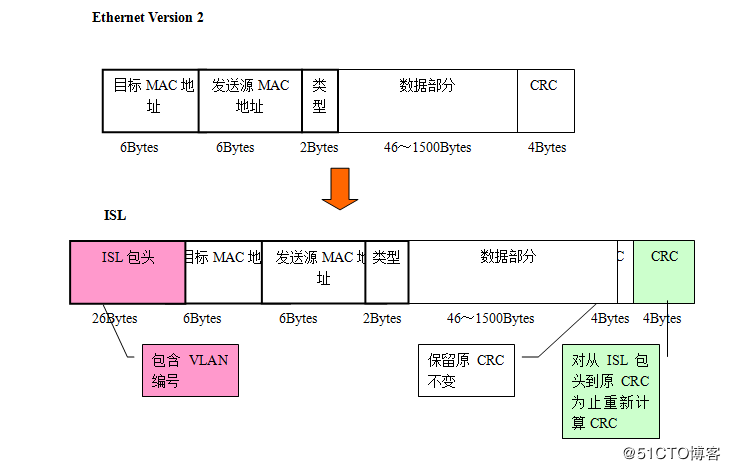

##### vlan间路由
使用IP层进行路由转发，因为在链路层，广播报文由于属于不同的vlan，无法广播

1. 借助外部支持汇聚链路的路由器    
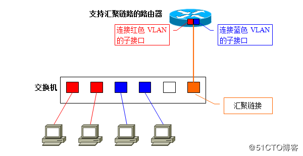

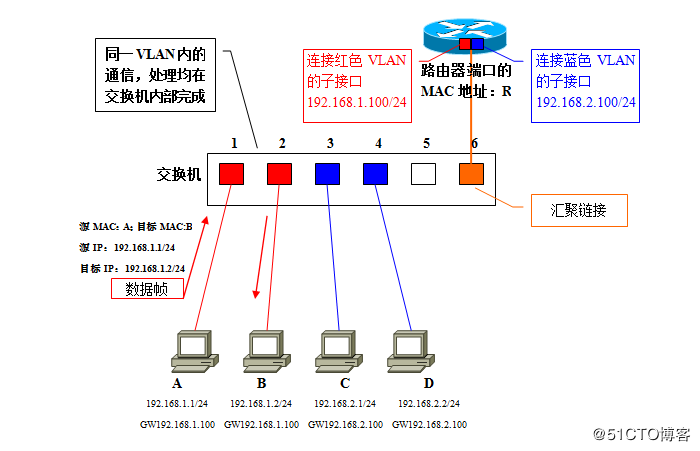   

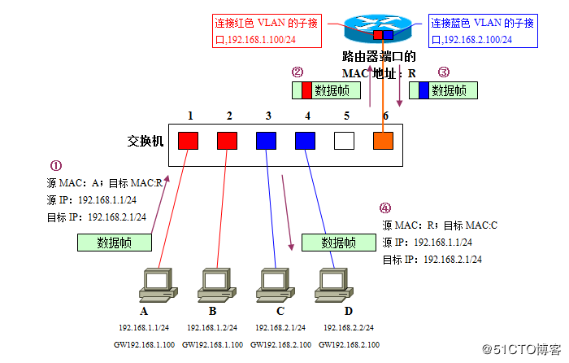  

##### 三层交换机
三层交换机，本质上就是“带有路由功能的（二层）交换机”。路由属于OSI参照模型中第三层网络层的功能，因此带有第三层路由功能的交换机才被称为“三层交换机”。
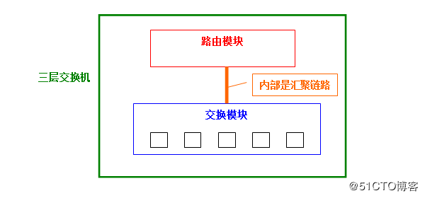
在一台本体内，分别设置了交换机模块和路由器模块；而内置的路由模块与交换模块相同，使用ASIC硬件处理路由。

同 vlan内  
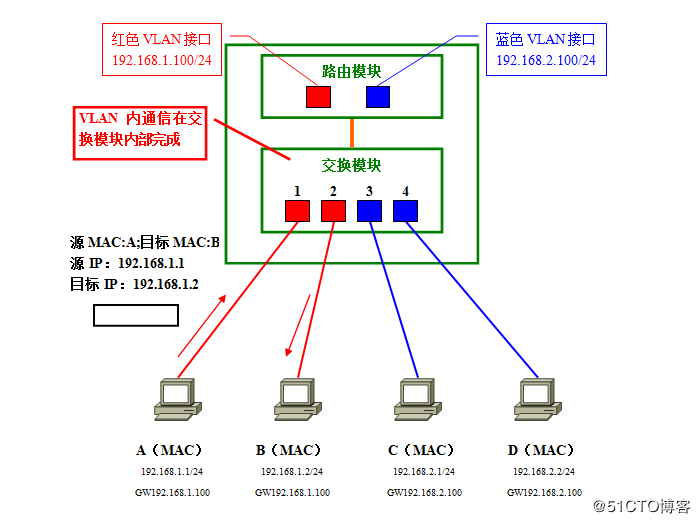

非同 vlan 内 
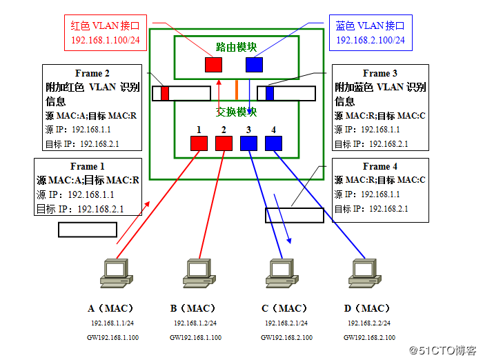

###### vlan建路由加速
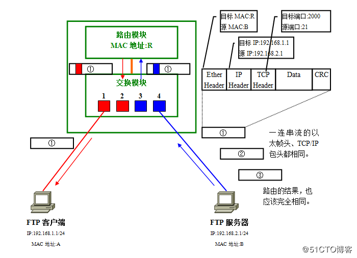
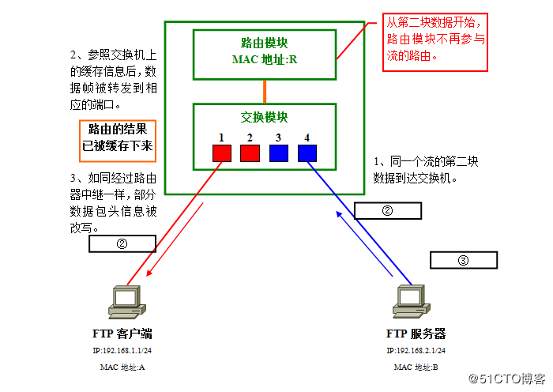

##### 布线差距
1. 传统的    
   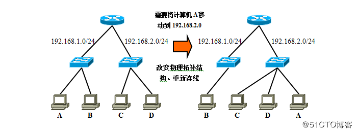
   
2. vlan     
   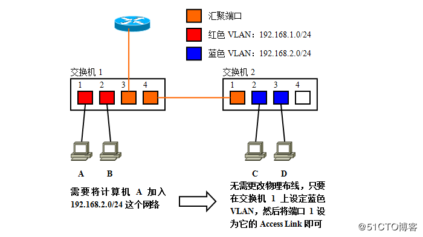
