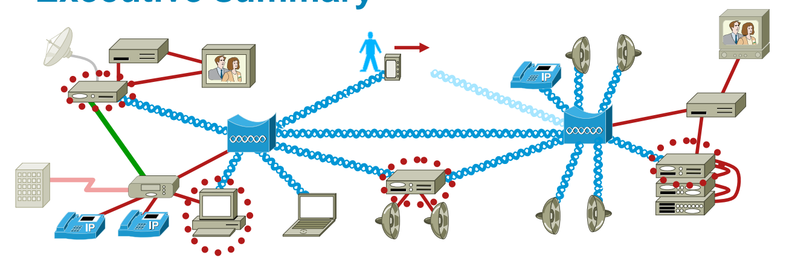
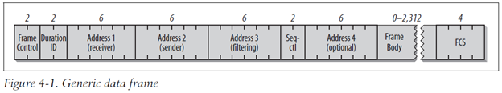
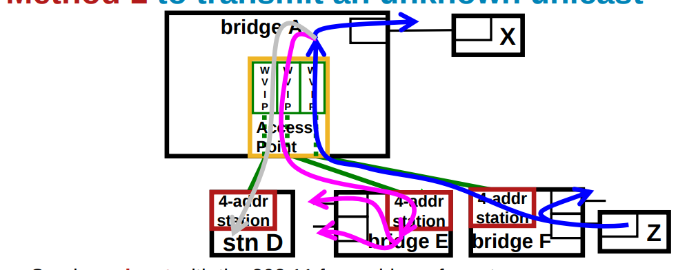
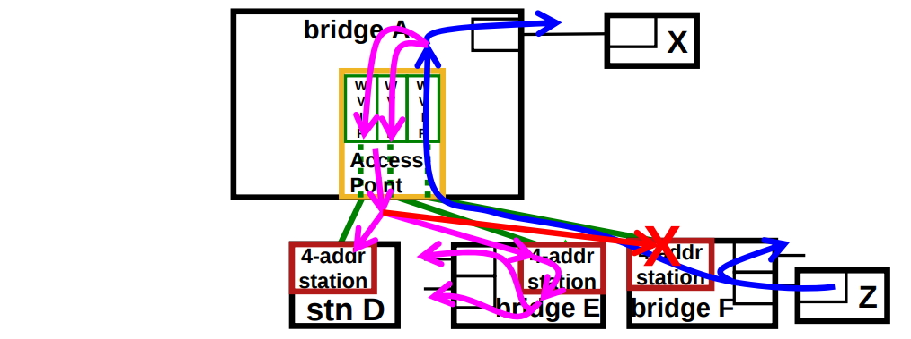

## 说明
一种标准化将非AP作为网桥的方式

## 框架图

## 报文详情

Receiver: 接收地址(中转或目的地)           
Transmitter: 转发地址(当前转发地址)           
Destination: 原生目标地址       
Source: 原生目标地址

## 连接流程(单播)
假设F网桥通过A网桥,将Z发生到W,如何确定不会被转发回原节点

##### 单播帧           

Receiver:STA E   
Transmitter:A      
Destination:W    
Source:Z

##### 组播帧

Receiver:Not station F        
Transmitter:A      
Destination:W    
Source:Z

## 参考
https://www.ieee802.org/1/files/public/docs2008/avb-nfinn-802-11-bridging-0308-v3.pdf        
https://blog.csdn.net/neilengineer/article/details/46285017

