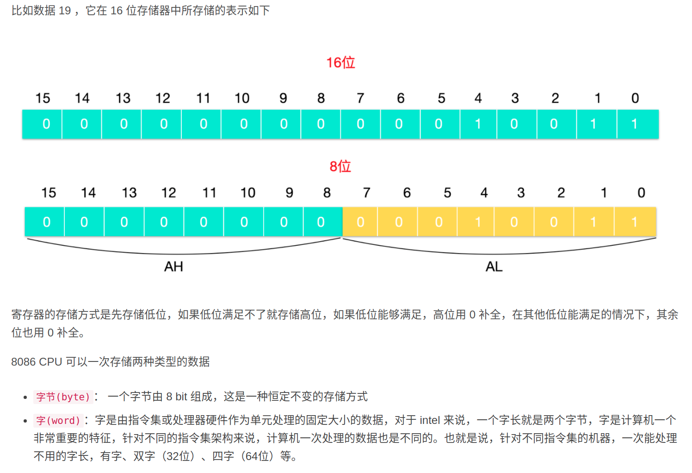

## CPU 基础
分为5个流程:   
1. 取指令    将内存中的指令 读取到寄存器  程序寄存器存储下一条指令的地址  
2. 指令译码     指令译码器按照预定的指令格式，对取回的指令进行拆分和解释
3. 执行指令     译码结束后就可以执行这条指令  
4. 访问取数     根据指令 地址码   得到操作数在内存的地址   并读取数据   
5. 结束写回     执行的结果写到寄存器   

## 寄存器
每个寄存器都有对应的名称:   
AX，BX，CX，DX，SP，BP，SI，DI，IP，FLAG，CS，DS，SS，ES
分为:   
### 通用寄存器: 16位  
可存储两个字节 用来存储一般数据    

  
AX(Accumulator Register):  累加寄存器，它主要用于输入/输出和大规模的指令运算   
分为 AH 和  AL 寄存器
AL为低地址8位    AH为高地址8位    当低8位不够储存时, 存放在高8位 
``` shell 
mov ax, 20    将20放入AX寄存器
mov ah, 80    将80放在AH寄存器
add ax, 10    将寄存器AX的值+10
```


BX(Base Register)：基址寄存器，用来存储基础访问地址    
暂存一般数据   或者用去寻址, 寻找物理内存地址   存放的数据一般是偏移地址   基地址的偏移  


CX(Count Register)：计数寄存器，CX 寄存器在迭代的操作中会循环计数  
计数器  用来存储LOOP次数 
次数 -1    当为0时, 跳出循环继续执行下一条语句  

DX(data Register)：数据寄存器，它也用于输入/输出操作。它还与 AX 寄存器以及 DX 一起使用，用于涉及大数值的乘法和除法运算。  

### 控制寄存器 
IP(Instruction Pointer)： 指令指针寄存器，它是从 Code Segment 代码寄存器处的偏移来存储执行的下一条指令
FLAG : Flag 寄存器用于存储当前进程的状态，这些状态有

### 索引寄存器
BP(Base Pointer)：基础指针，它是栈寄存器上的偏移量，用来定位栈上变量   
SP(Stack Pointer): 栈指针，它是栈寄存器上的偏移量，用来定位栈顶   
SI(Source Index): 变址寄存器，用来拷贝源字符串   
DI(Destination Index): 目标变址寄存器，用来复制到目标字符串   

### 段寄存器  
CS(Code Segment) ： 代码寄存器，程序代码的基础位置   
DS(Data Segment)： 数据寄存器，变量的基本位置 
SS(Stack Segment)： 栈寄存器，栈的基础位置  
ES(Extra Segment)： 其他寄存器，内存中变量的其他基本位置 

## 内存
1. CPU缓存  
CPU只负责运算, 不存储数据, 数据一般放在内存之中.   
为了避免被拖慢  CPU都自带一级缓存 和 二级缓存    
CPU缓存数据不够快  并且地址不固定  
而寄存器是为了解决以上的问题   

2. 寄存器 
CPU自带寄存器   用来储存最常用是数据   
CPU优先读取寄存器  再由寄存器与内存交换数据   
