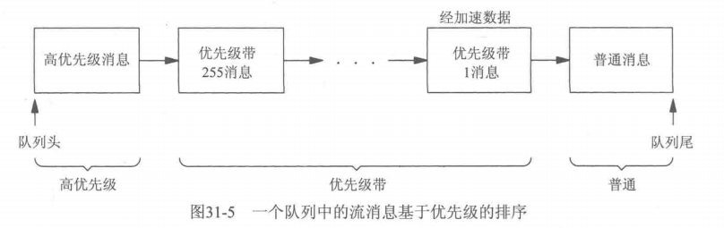

## 说明

STREAMS（流）是系统V提供的构造内核设备驱动程序和网络协议包的一种通用方法         
流在用户进程和设备驱动程序之间提供了一条全双工通路

流头由一些内核例程组成,应用程序使用 read write putmsg ioctl激活例程    


基础处理模块           


带处理模块的流      


## 处理模块

1. 任意数量的处理模块可以压入流
2. STREAMS模块是作为内核的一部分执行的，这类似于设备驱动程序
3. 用文件I/O中说明的函数访问流，它们是：open、close、read、write和ioctl
4. 打开（open）流时使用的路径名参数通常在/dev目录之下

## 重点

### 多路复选器
是一种特殊类型的伪设备驱动程序,应用程序使用库与相应的流模块,通过STREAM与驱动程序通信     
例如典型的socket,外部使用socket函数库,将sockmod嵌入流模块, 实现了TPI (Transport Provider Interface)通信


### STREAMS消息
STREAMS的所有输入和输出都基于消息,流每个部件都有双缓存区


队列中流消息优先级

一般只使用 1  0


流首和用户进程使用read、write、ioctl、getmsg、getpmsg、putmsg和putpmsg交换消息

``` c
struct strbuf{
    int    maxlen;    /* size of buffer */
    int    len;       /* number of bytes currently in buffer */
    char   *buf;      /* pointer to buffer */
};
```